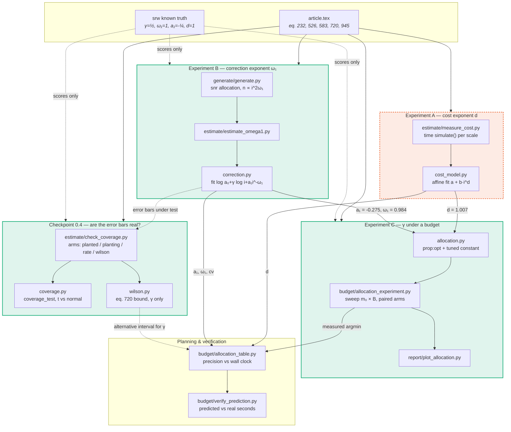

# Repository catalog

A map of every first-party module, what it is for, and how the pieces connect.
Written 2026-08-24 as step zero of a reorganization, refreshed 2026-08-25: the point is to make the
current structure legible enough to change safely, **not** to defend it. Where the
current placement looks wrong, the "Notes" column says so.

Scope: `tools/`, `src/`, `models/` — 22 modules, ~5,800 lines, 109 module-level
public functions (§4 indexes the ones worth naming). Not covered: `tools/tests/`
(gitignored, local-only), `experiments/*/` (recipes + data, no code), `derivations/`
(LaTeX).

---

## 1. The experiment ladder

**Reading the diagram.** Solid arrows carry measured constants; dotted arrows are
"is validated by" / "is an alternative to". Green = complete; **orange dashed =
Experiment A, the one piece never run** — `measure_cost.py` and `cost_model.py`
exist and the affine fit already recovers $d = 1.007$ from $n=1$ timings, but the
planned amortized/batched cross-check (`plans/three_experiment_ladder.md` §2) was
skipped as probably redundant.

The dependency that matters most for reorganization: **B and A feed C, and nothing
feeds back.** The ladder is a DAG, so the three experiments could be split into
separate packages without cycles. The only shared state is the measured constants,
which travel as JSON on disk (`omega1.json`, cost-probe metadata), not as imports.

---

## 2. Classification

Tags, as requested, with one addition (`model`) flagged in §5:

| tag | meaning |
|---|---|
| `tool` | generic infrastructure, no statistics of its own |
| `statistical tool` | estimators, inference, calibration |
| `budget tool` | allocation, cost model, budget accounting |
| `plot tool` | produces figures |
| `experiment` | a runnable driver that produces a result someone reads |
| `model` | the simulated object under study *(added — see §5)* |

---

## 3. Modules

### `tools/` — imported, never run directly

| module | L | tags | purpose | depends on |
|---|---|---|---|---|
| `loglog.py` | 253 | `statistical tool` | Four $\hat\gamma$ estimators + the article's closed-form eq. (526) weights. **The canonical weight definition** — `allocation.py` and `wilson.py` import it. | — |
| `correction.py` | 215 | `statistical tool` | Two $\omega_1$ estimators: direct fit of eq. (232), and bias-decay fit. Non-convex in $\omega_1$, hence multi-restart. | — |
| `allocation.py` | 405 | `budget tool` | `prop:opt` (eq. 945–946), `lem:budget` costs, and the **tuned constant** $\kappa$ that the rate theorem drops. Also `snr`/`neyman` per-scale rules. | `loglog` |
| `cost_model.py` | 287 | `budget tool`, `statistical tool` | Cost exponent $d$: pure power law and the affine $a + b\,i^d$ that fixed the small-scale regime. Timing aggregators + median CI, and the declared-vs-measured cross-check. | `loglog` |
| `wilson.py` | 276 | `statistical tool` | Article eq. (720)'s four-term bound, **for $\gamma$ only**. `moment_bounds` reads its constants off real samples. | `loglog` |
| `coverage.py` | 356 | `statistical tool` | Calibration harness: do our stated error bars cover? `coverage_test`, `coverage_multi`, `rescore`, `combine_se`, Welch–Satterthwaite dof. | — |
| `artifacts.py` | 314 | `tool` | The naming registry: what every file on disk is called, in (recipes, by `kind`) and out (run artifacts, by content). Provenance is stamped inside each file, not in its name. | — |
| `persistence.py` | 153 | `tool` | Run directories, `samples.npz` vs chunked `samples/`, metadata sidecars, content hashing. | — |
| `models.py` | 95 | `tool` | `ModelSpec` registry. Pure importer — simulation lives in `models/`. | `srw`, `synthetic` |
| `loglog_plot.py` | 185 | `plot tool` | Generic log-log chart + the four-estimator comparison chart. | — |

### `src/` — the scripts a human runs

Split into four layers on 2026-08-25 (see §5.3).

| module | L | tags | purpose | depends on |
|---|---|---|---|---|
| `generate/generate.py` | 357 | `experiment`, `tool` | Draw samples per a recipe. Allocation rules (`snr`/`neyman`), chunked output for large $n$. | `allocation`, `models`, `persistence` |
| `estimate/measure_cost.py` | 214 | `experiment`, `budget tool` | **Experiment A**: time `simulate()` per scale, fit $d$, and score it against the model's declared `cost_hint`. | `cost_model`, `loglog`, `models`, `persistence` |
| `estimate/estimate_omega1.py` | 198 | `experiment`, `statistical tool` | **Experiment B**: $\omega_1$, $a_1$, $\gamma$, $a_0$ from one run. | `correction`, `loglog`, `persistence` |
| `budget/allocation_experiment.py` | 388 | `experiment`, `budget tool` | **Experiment C**: sweep $m_0\times B$; paired `prop:opt` / tuned arms. | `allocation`, `loglog`, `models`, `persistence` |
| `estimate/check_coverage.py` | 435 | `experiment`, `statistical tool` | **Checkpoint 0.4**: four arms — `planted`, `planting`, `rate`, `wilson`. Holds srw's exact moments as *scoring* truth. | `coverage`, `wilson`, `correction`, `allocation_experiment`, … |
| `budget/allocation_table.py` | 630 | `budget tool`, `statistical tool` | Planning: precision vs wall clock. Discovers run groups, pools replicates, reports provenance. **Largest module — see §5.** | `allocation`, `correction`, `persistence` |
| `budget/verify_prediction.py` | 190 | `experiment`, `budget tool` | Runs tuned ladders for real; predicted vs measured seconds and RMSE. | `allocation`, `allocation_table`, `loglog`, … |
| `report/plot_allocation.py` | 325 | `plot tool` | Experiment C's two panels: $m_0$ tradeoff, and measured vs predicted decay rate. | `allocation_experiment`, `allocation_table`, `coverage` |
| `report/plot_loglog.py` | 162 | `plot tool` | Raw data + estimator comparison for any run. | `loglog`, `loglog_plot`, `models`, `persistence` |
| `report/plot_cost.py` | 88 | `plot tool` | Cost-probe timings. | `loglog_plot` |

### `models/` — the simulated objects

| module | L | tags | purpose |
|---|---|---|---|
| `srw.py` | 143 | `model` | $\lvert S_k\rvert$ for a $\pm1$ random walk. Deliberately $\Theta(k)$: integer-style stepping, **not** `binomial`, so it stays a percolation stand-in with real cost. |
| `synthetic.py` | 136 | `model` | Planted eq. (232) generator with arbitrary $(a_j,\omega_j)$ and pluggable noise. The only model with a `target_fn`. |

---

## 4. Function index

<b>tools/</b> — the public surface worth naming (64 module-level functions in all)

| function | module | what it is |
|---|---|---|
| `ols_slope` | loglog | OLS fit, returns (slope, intercept) |
| `gamma_all_points` | loglog | $\hat\gamma$ from every scale |
| `gamma_two_point` | loglog | $\hat\gamma$ from adjacent pairs |
| `gamma_drop_leading` | loglog | $\hat\gamma$ dropping the smallest scales |
| `closed_form_weights` | loglog | **eq. (526)** — the one definition |
| `gamma_closed_form` | loglog | eq. (523–526); validates the consecutive grid |
| `gamma_mle` | loglog | Gaussian MLE, with `trustworthy` diagnostics |
| `compare_methods` | loglog | all four, bundled |
| `fit_correction` | correction | eq. (232) fit → $(a_0,\gamma,a_1,\omega_1)$ |
| `omega1_from_bias_decay` | correction | $\omega_1$ from how $\hat\gamma_i$ drifts |
| `total_cost` | allocation | `lem:budget` geometric sum |
| `feasible` | allocation | $\theta_1+d\theta_2=1$ self-check |
| `optimal_allocation` | allocation | **eq. (945–946)**, as written |
| `allocation_constants` | allocation | $C_b$, $C_s$, $G$, $\kappa$, offset |
| `tuned_allocation` | allocation | eq. (946) + restored constant |
| `predict_error` | allocation | bias/sd/RMSE for a given ladder |
| `snr_allocation` | allocation | $n_i\propto i^{2\omega_1}$ — right for $\omega_1$ |
| `neyman_allocation` | allocation | $n_i\propto i^{-d/2}$ — kept as the documented *wrong* answer |
| `estimate_cost_exponent` | cost_model | pure power-law $d$ |
| `estimate_cost_affine` | cost_model | $a+b\,i^d$ — the fit that rescued small scales |
| `aggregate` | cost_model | min/median/mean/q95/iqmean |
| `median_ci` | cost_model | order-statistic CI |
| `sigma_se` | wilson | eq. (720) 4th term |
| `sigma_se_per_scale` | wilson | non-uniform $n$ (**not** in the article) |
| `finite_size_bias` | wilson | $\mathcal B_{\rm fs}$ |
| `good_event_bias` | wilson | $\mathcal B_{\rm good}$ |
| `bad_event_bias` | wilson | $\mathcal B_{\rm bad}$ |
| `moment_bounds` | wilson | $\sigma_\infty^2,\sigma^2_{\max},\Lambda$ from samples |
| `wilson_interval` | wilson | the assembled bound + `complete` flag |
| `format_interval` | wilson | breakdown, incompleteness first |
| `wilson_score_interval` | coverage | **binomial** score CI — unrelated to eq. (720) |
| `interval` | coverage | est ± q·se, normal or $t_{\rm dof}$ |
| `coverage_test` | coverage | replay N times, count hits |
| `coverage_multi` | coverage | many quantities, one pass |
| `rescore` | coverage | re-ask at another level, free |
| `combine_se` | coverage | quadrature + Welch–Satterthwaite |
| `consistency_threshold` | coverage | the honest \|z\| cut-off |
| `se_ratio`, `format_result` | coverage | diagnostics |
| `declared_exponent` | cost_model | $d$ from a model's own `cost_hint` — exact, not fitted |
| `compare_cost_models`, `format_cost_comparison` | cost_model | declared vs wall clock, two tolerances |
| `ARTIFACTS`, `artifact_path`, `write_artifact`, `read_artifact` | artifacts | run outputs, named for content |
| `classify`, `migrate`, `find_artifacts` | artifacts | legacy rescue |
| `RECIPES`, `load_recipe`, `recipe_kind`, `recipe_name` | artifacts | inputs, validated by `kind` on load |
| `default_out_dir` | artifacts | the experiment's `data/`, not the recipe's sibling |
| `normalize_scales_n`, `run_dir`, `save_samples`, `open_scale_writer`, `load_samples`, `load_metadata`, `content_id`, `write_metadata` | persistence | run I/O |
| `ModelSpec`, `get_model` | models | registry |
| `loglog_points`, `loglog_plot`, `estimates_plot` | loglog_plot | charts |

<b>src/</b> — the public surface worth naming (37 module-level functions in all)

| function | module | what it is |
|---|---|---|
| `generate`, `reproduce` | generate | draw / regenerate from a recipe |
| `measure` | measure_cost | time `simulate()` per scale |
| `estimate` | estimate_omega1 | both $\omega_1$ estimates for a run |
| `ladder` | allocation_experiment | `def:alloc` scales; rejects rounding collisions |
| `n_for_budget` | allocation_experiment | largest uniform $n$ within $B$ |
| `run_cell` | allocation_experiment | one replicate |
| `sweep` | allocation_experiment | the $m_0\times B$ grid, both arms |
| `summarize` | allocation_experiment | per-budget arm scoring |
| `rate_exponent`, `rate_exponent_se` | allocation_experiment | decay slope + its own error |
| `exact_mean`, `exact_sd` | check_coverage | srw truth (scoring only) |
| `make_experiment` | check_coverage | replay Experiment B, both centres |
| `make_wilson_experiment` | check_coverage | eq. (720) coverage arm |
| `make_rate_experiment` | check_coverage | analytic-se arm |
| `check_planting` | check_coverage | KS: is $\overline Y$ really Gaussian? |
| `discover_groups`, `format_groups`, `choose_group`, `find_omega1_runs` | allocation_table | run-group discovery/selection |
| `measured_a1`, `measured_correction`, `measured_cv`, `measured_cost_exponent`, `measured_throughput` | allocation_table | constants, with provenance |
| `predicted_rate`, `budget_for_m0`, `offset_uncertainty` | allocation_table | planning math |
| `build_rows`, `build_budget_rows`, `human_time` | allocation_table | table rendering |
| `run_ladder`, `verify` | verify_prediction | predicted vs real |
| `plot_allocation` | plot_allocation | Experiment C figure |

---

## 5. Observations for the reorganization

Things the table makes visible, offered as input to a future restructuring.
**Items 3 and part of 6 have since been acted on** (2026-08-25) and are kept here
with their outcome, rather than deleted, so the reasoning stays readable.

1. **`src/budget/allocation_table.py` is 627 lines and does three jobs**: discovering
   run groups on disk, extracting measured constants with provenance, and
   rendering tables. The first two are library work that `plot_allocation.py`,
   `verify_prediction.py` and `check_coverage.py` all reach into `src/` to get —
   which is backwards, since `src/` is supposed to be leaf scripts. Splitting the
   constant-extraction half into `tools/measured.py` would remove the only
   `src/ → src/` imports in the repo.

2. **`src/estimate/check_coverage.py` holds srw's exact moments.** Deliberate — truth must
   never reach an estimator — but it means a *driver* owns model knowledge. If
   Phase 2 adds RWRE, this file will grow a second model's truth. A
   `models/<name>_truth.py` convention, imported only by drivers, would scale
   better while keeping the separation.

3. ~~**The `tool` / `experiment` split is clean, but `src/` mixes two kinds of
   script**: generators of data and readers of it. A `src/run/` vs `src/report/`
   split would make the DAG in §1 visible in the filesystem.~~ **Done**, with four
   layers rather than two — `generate/`, `estimate/`, `budget/`, `report/` — named
   for the question each answers rather than for read/write. Note this did *not*
   fix item 1: `allocation_table.py` is still imported by three siblings, now
   across layer boundaries, which is if anything more visible.

4. **`models/` needed a sixth tag.** Your five don't cover a simulated object;
   `tool` would be misleading since these *are* the thing under study. I used
   `model` — say if you'd rather fold it into `tool`.

5. **Two names collide meaningfully**: `wilson.py`'s eq. (720) interval and
   `coverage.py`'s `wilson_score_interval` (binomial). Both docstrings warn, but
   a rename (`score_interval`?) would remove the trap.

6. **Experiment A is the only dashed box.** Either run it as the cross-check
   `plans/three_experiment_ladder.md` §2 describes, or close the item explicitly
   — right now `measure_cost.py` is doing A's job without A's name. *Partly
   addressed*: `measure_cost.py` now cross-checks the measured $d$ against the
   model's declared `cost_hint` (srw: declared $1$ vs measured $1.0028\pm0.0020$),
   which is one of the two cross-checks A was for. The amortized/batched timing
   comparison is still unrun.
