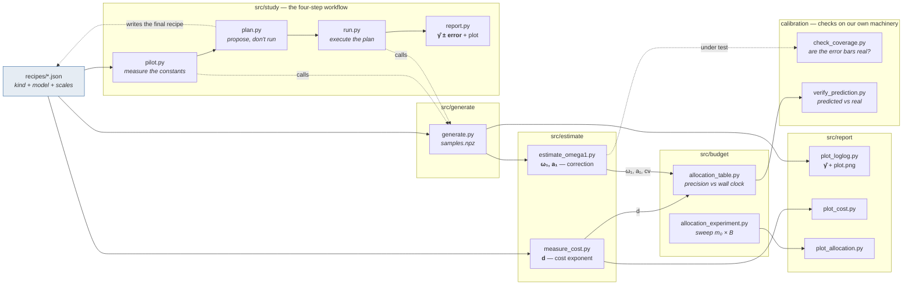

# loglog_validation

Simulation validation for the paper **"The Log-Log Plot Technique"**
(`../article_writting/article.tex`). The paper's theorems say what $\hat\gamma$ should
cost and how accurate it should be; this repo runs the simulations that check whether
they do. Writing and review of the paper happen in `article_writting/`, not here.

Every formula is taken from the article by equation number (`PLAN.md` has the
cross-reference table); nothing is re-derived, and no estimator is ever handed the
answer it is measuring.

## The main functions



Solid arrows carry data or measured constants. `src/` holds the eight pipeline
drivers, `calibration/` the three that check the pipeline itself (two statistical,
one an audit of every function and flag); the functions they all
call live in `tools/`, and the simulators in `models/`.

There is exactly **one sampler** — `generate.py`. `pilot.py` and `run.py` do not draw
samples themselves; each calls it once, differing only in what it does with the
result (measure the constants, or execute an accepted plan). That is why the dotted
arrow closes the loop: `plan.py --accept` writes its allocation back out as an
ordinary recipe, so the planned run is the same kind of thing as any other run.

| layer | asks | reads | writes |
|---|---|---|---|
| `src/generate` | what does $Y_i$ look like? | a recipe | `samples.npz`, `samples_meta.json` |
| `src/estimate` | what are $d$, $\omega_1$, $a_1$ — and is the stated $\pm$ honest? | samples | `cost_probe.json`, `omega1.json`, `coverage.json` |
| `src/budget` | how long must I run for a given precision? | those constants | `allocation_sweep.json` |
| `src/report` | what does it look like, and what is $\hat\gamma$? | any of the above | `gamma_estimates.json`, `plot.png` |
| `src/study` | **start here**: pilot → plan → run → report, carrying constants for you | a recipe | `constants.json`, `report.md`, `details.md` |
| `calibration/` | are our **own** stated numbers honest — the ± and the ETA? and does every function still behave as documented? | the pipeline itself | `coverage.json`, `prediction_check.json` |
| `tools/` | *(imported, not run — except `artifacts.py --list/--migrate`)* — estimators, allocation rules, calibration, seeding, I/O | | |
| `models/` | the simulated object itself: `srw`, `synthetic` | | |

## Quickstart

```bash
python3 -m venv .venv && source .venv/bin/activate
pip install -r requirements.txt

D=experiments/01_srw/data

# all four steps, deciding in between. --time is the TOTAL, pilot included
python3 src/study/autopilot.py -meta experiments/01_srw/recipes/samples_pilot.json \
        --study mystudy --time 2h

# -- or one at a time, to read each verdict before spending the next hour --

# 1. cheap pilot: measures d, omega1, a1, cv and this machine's throughput
python3 src/study/pilot.py -meta experiments/01_srw/recipes/samples_pilot.json \
        --study mystudy --replicates 3

# 2. what would a longer run cost? proposes, draws nothing
python3 src/study/plan.py --study mystudy --data-root $D --time 90s
python3 src/study/plan.py --study mystudy --data-root $D --time 90s --accept

# 3. execute it, then read the answer
python3 src/study/run.py    --study mystudy --data-root $D
python3 src/study/report.py --study mystudy --data-root $D
```

No constant is ever retyped between steps — the study directory carries them,
each with its error and its provenance. `plan` prints an error budget and a
verdict on whether the pilot is good enough to act on, then **stops**; accepting
is a separate command. See `src/study/README.md`, especially on why a short
pilot cannot determine $\omega_1$.

`src/README.md` is the full command reference, one section per driver.
`CATALOG.md` maps every module and function with its classification.

```bash
# every public function and every CLI flag, once, in dependency order (~7 min)
python3 calibration/exercise_all.py
python3 calibration/exercise_all.py --stage tools      # just the leaf layer
```

`calibration/exercise_all.py` is the audit: it calls each function on its normal
inputs *and* on the degenerate ones, runs each driver across its flags, and
prints `PASS` / `FAIL` / `NOTE` — the last for behaviour that is as written but
worth a human's eye (a flag that does nothing, a message that misleads, an
unreachable branch). `tools/tests/` still owns the closed-form assertions.

## Where things go

- A **recipe** is an input, lives in `experiments/<exp>/recipes/`, and is named
  `<kind>_<name>.json` (`samples_omega1.json`, `sweep_wide.json`). Each declares its
  `kind`, which the driver validates on load — pointing a script at the wrong recipe
  is now an error that names the mistake.
- A **run** is one output directory under `experiments/<exp>/data/<tag>/`, holding
  every file about that run. Names say *what the file is*, not what wrote it
  (`tools/artifacts.py` is the single source of truth; provenance is stamped inside
  each file as `produced_by`). `data/` is gitignored — copy a figure into the
  experiment's `images/` when it becomes evidence worth keeping.

- **Imports** are always written out in full — `from tools.loglog import ...`,
  `from src.generate.generate import ...`, `from models import srw` — never by bare
  name. Only the file you type on the command line puts the repo root on `sys.path`
  (two guarded lines, next to its `ROOT =`); `conftest.py` does the same for pytest, and
  nothing under `tools/` or `models/` touches the path at all. `PLAN.md`'s *Imports*
  section has the reasoning.

## Status

All three experiments pass, along with checkpoint 0.4 (error-bar calibration, which
found and fixed a real defect: intervals labelled 95% were covering 88%).
**A** ($d$): the cost probe recovers it from the wall clock and scores it against each
model's declared `cost_hint` on every run — closed 2026-09-04 with that cross-check
standing rather than pending, and its amortized/batched second route dropped as
redundant to the affine fit. **B** ($\omega_1$) and **C** ($\gamma$ under a budget) pass
against known truth. `TODO.md` tracks the detail; each experiment's own README states
its numeric acceptance criteria and what was measured against them.

## Environment

Pinned to Python 3.9.2 / numpy 2.0.2 / scipy 1.13.1 / matplotlib 3.9.4 / pytest 8.4.2 —
same versions as `../loglog_experiments/`'s environment. `.venv/` is gitignored;
recreate it with the commands above rather than committing it. Run the test suite with
`python3 -m pytest tools/tests/` (gitignored, local-only, 290 cases).

This is a from-scratch restart of `../loglog_experiments/` (kept as historical
reference, not reused) — see `PLAN.md` for why, plus the ground rules and the full
experiment ladder.
