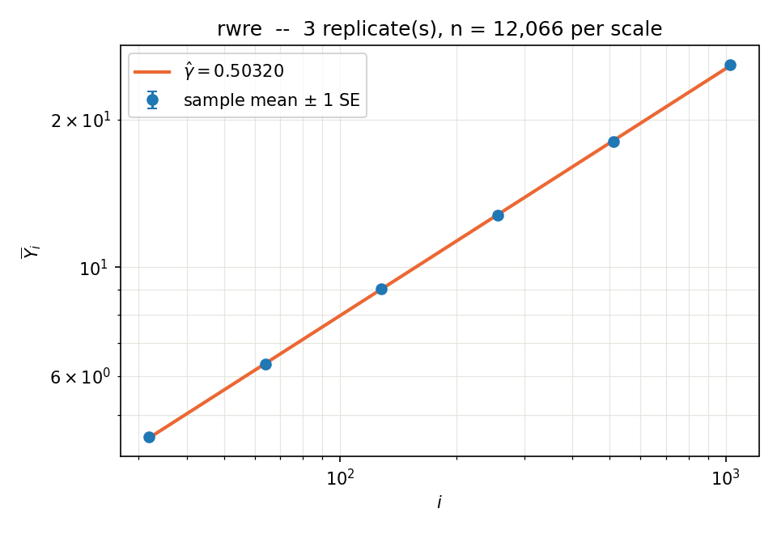
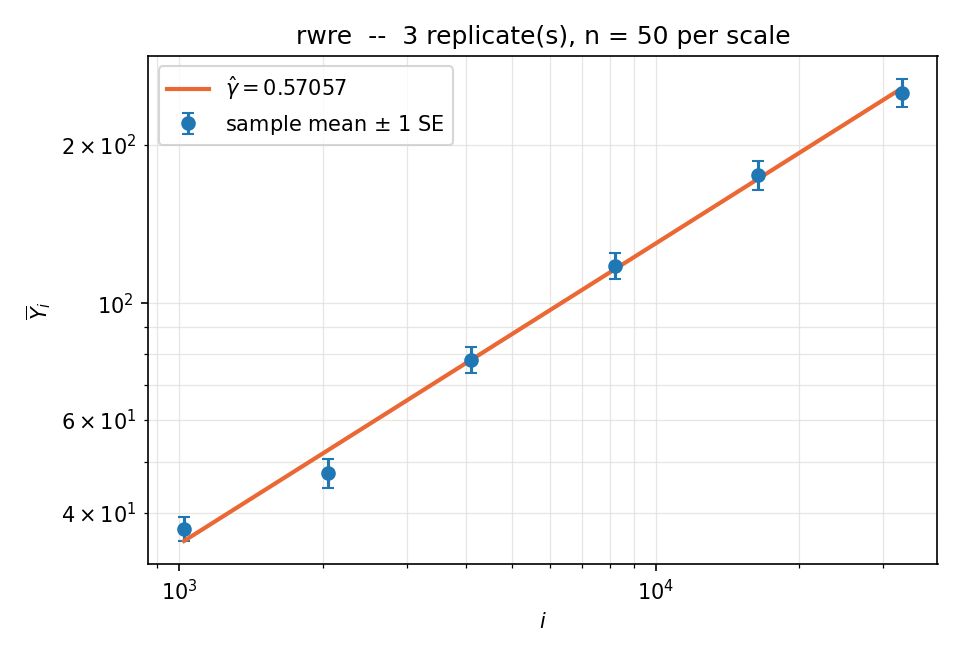

# 02_rwre — Random Walk in Random Environment

**Status: all six acceptance criteria measured (2026-09-15/16).** PLAN.md's ladder
step 3 — the first rung where the exponent being measured is *not known*, by anyone.

**The result in one line:** at density $\alpha=1/2$ the walk is diffusive only at
$p=1/2$, where it *is* a simple random walk; at every other $p$ on the grid the measured
exponent sits above $1/2$ by many standard errors, peaking at
$\hat\gamma\approx0.578$ near $p\approx0.30$. The control arm at $p=1/2$ returns
$0.5002\pm0.0022$ against the exact $1/2$, with $\omega_1=1.10\pm0.43$ and
$a_1=-0.281\pm0.165$ against srw's exact $1$ and $-1/4$ — so the excess is not the
estimator, the ladder, or the machine.

## The model

The environment is a one-dimensional simple symmetric exclusion process at density
$\alpha$ (the density gets its own letter because $\rho$ is the geometric scale ratio
everywhere in this repo). Above it walks a walker whose local drift depends on what it
is standing on:

$$P(\text{left}\mid\text{particle}) = p,\qquad P(\text{left}\mid\text{hole}) = 1-p,$$

and the observable is $Y_k=\lvert X_k\rvert$ after $k$ walker steps — the same
observable as `01_srw`. At $p=1/2$ the two rules coincide, the environment cannot be
read at all, and the walk **is** a simple random walk; that is what makes `01_srw` a
literal control arm rather than a loose analogy.

`models/rwre.py`, registered as `MODELS["rwre"]`. Parameters: `p`, `alpha` (0.5),
`env_sweeps` (4), `swap_prob` (0.5), `window_c` (12.0).

### Four things the phrase "particles move to adjacent empty sites" does not say

Each of these moves the answer, so each is a stated decision (2026-09-15) rather than an
implementation detail.

**(a) The environment update.** A brick-wall parity sweep: pick a parity $b\in\{0,1\}$,
and every bond of that parity swaps its two sites independently with probability
`swap_prob`. Because the swap is applied to the *sites* and not to the particles, this
is the **stirring construction** — a random permutation of coordinates chosen
independently of the configuration — from which two closed forms follow:

- product Bernoulli$(\alpha)$ is **exactly** invariant, at every time and for every
  $\alpha$, so the environment's law is a thing a test can assert rather than a
  convergence a test has to hope for;
- the particle count is conserved **per sample**, which a broken wrap bond would break
  while still conserving the total.

Observing only occupancies, stirring *is* the SSEP. The parity is drawn per sample:
sharing it across the block would correlate rows that ground rule 2 requires to be
i.i.d., and making it deterministic ($b=t \bmod 2$) would be worse than either, since
the walker's index parity is also fixed by $t$ and the walker would sit on the left
endpoint of its own active bond at every step.

**(b) The order within a step.** Read $\eta_t(X_t)$, jump, *then* stir. No swap happens
"during" the walker's own jump.

**(c) The rate.** `env_sweeps` sweeps per walker step. A bond is picked when its parity
is, so the expected swap attempts per bond per unit time is

$$\gamma_{\rm eff} = \frac{\texttt{env\_sweeps}\cdot\texttt{swap\_prob}}{2},$$

which is exactly the $\gamma$ of the literature below (walk at rate 1, SSE generator at
rate $\gamma$ per bond). The default $(4,\,1/2)$ gives $\gamma_{\rm eff}=1$: walk and
environment at the same rate. `env_sweeps = 0` freezes the environment and gives Sinai's
RWRE.

**(d) The window.** Periodic, of width $W(k)=\texttt{window\_c}\cdot\lceil\sqrt k\rceil$
rounded up to even, with the walker starting at the centre. The walk moves $\sim\sqrt k$
and the SSEP transports information diffusively, so the probability that anything wraps
is bounded by $2e^{-c^2/8}\approx1.5\times10^{-8}$ at the default $c=12$ — small enough
that no $\sqrt{\log k}$ factor is needed, which matters because it leaves

$$\mathrm{cost}(k) = k\,W(k) = c\,k^{3/2}$$

an **exact** power law: Assumption 7 (eq. 353) holds here with $d=3/2$ on the nose, the
first non-integer $d$ in this repo and the third that is known rather than fitted. $W$ is
even so that both parities are perfect matchings of the periodic window.

Every sample is **annealed**: a fresh environment and a fresh walk, as ground rule 2
requires. One environment carrying many walks is the quenched measure — a different
experiment, and not one `models/rwre.py` can be talked into.

## Two exact symmetries, derived rather than assumed

Particle–hole ($\eta\to1-\eta$) preserves Bernoulli$(1/2)$ and the dynamics, and maps
rule $p$ to rule $1-p$ at fixed $X$. Reflection ($x\to-x$) also maps rule $p$ to rule
$1-p$, but with $X\to-X$. Composing them:

$$X_k \overset{d}{=} -X_k \quad\text{for every } p \qquad\Longrightarrow\qquad \mathbb E X_k = 0 \text{ exactly},$$

$$\lvert X_k\rvert \text{ has the same law at } p \text{ and at } 1-p.$$

The first is the environment's zero-check: a drift at several standard errors is a bug,
not physics. The second halves the sieve — $p\in[0,1/2]$ carries all the information.
Both are tested (`tools/tests/test_rwre.py`).

## What is known, and what is not

- **Hilário, Kious, Teixeira**, *Random walk on the simple symmetric exclusion process*,
  [arXiv:1906.03167](https://arxiv.org/abs/1906.03167), Comm. Math. Phys. 379 (2020).
  This model exactly. They prove an LLN for all densities except at most two, and a
  functional CLT **only where the speed is non-zero**. For the special case of density
  $1/2$ with the jump distributions on a particle and on a hole symmetric to each other
  — *our* case — they prove an LLN with **zero** limiting speed. No CLT there. **The
  fluctuation exponent at $\alpha=1/2$ is open.**
- **Avena, Thomann**, *Continuity and anomalous fluctuations in random walks in dynamic
  random environments: numerics, phase diagrams and conjectures*,
  [arXiv:1201.2890](https://arxiv.org/abs/1201.2890), J. Stat. Phys. 147 (2012)
  1041–1067. Simulations of the same model; their eq. (1.5) is the rule above with their
  $p=P(\text{right}\mid\text{particle})$, so **our $p=1/3$ is their $p=2/3$**. Their
  Conjecture 3.5: for the SSE there exist $\tilde\gamma_1<\tilde\gamma_2$, both
  increasing in $p$, with the walk sub-diffusive for $\gamma<\tilde\gamma_1$,
  super-diffusive for $\tilde\gamma_1<\gamma<\tilde\gamma_2$ and diffusive above. This is
  the conjectured critical parameter; at fixed environment rate it becomes a critical
  $p$. Their Figure 17 tabulates measured exponents at $\rho=0.5$ over a $(p,\gamma)$
  grid.
- **Their estimator is $\alpha(n)=\log(\mathrm{SD}_n)/\log n$ at the largest $n$.** They
  state its $\log c/\log n$ bias themselves and do not remove it — which is precisely
  what the weighted estimator (eq. 523–526) plus a fitted correction-to-scaling exists to
  do. Our ladder, budget and sieve grid were fixed **without** reference to their grid
  (user's decision: measure cold, compare afterwards), and their numbers are read only
  once ours exist.
- **Not** Kesten–Spitzer. A static i.i.d. environment of this kind is **Sinai's RWRE** —
  recurrent at density $1/2$ with $X_t\sim(\log t)^2$ (Avena–Thomann §2.1–2.2). Kesten–
  Spitzer $k^{3/4}$ is random *scenery*, a different model. This correction matters
  because it is the `env_sweeps = 0` limit of our own parameter.

## Acceptance criteria

Numbers, not adjectives (ground rule 1). A2 must pass before A5 is quoted, and A5 before
the sieve is spent.

| | criterion | status |
|---|---|---|
| **A1** | cost: the measured exponent recovers the declared $d=3/2$ | **PASS** |
| **A2** | calibration at $p=1/2$: $\hat\gamma=1/2$, $a_0=\sqrt{2/\pi}$, $\omega_1=1$, $a_1=-1/4$ each inside their se, plus a two-sample KS against `srw` draws at matched $k$ | **PASS** |
| **A3** | zero-check: $\lvert\mathbb E X_k\rvert<3$ se at every scale | **PASS** |
| **A4** | window: doubling `window_c` from 12 to 24 moves $\hat\gamma$ by less than 1 se | **PASS** |
| **A5** | headline at $p=1/3$: $\hat\gamma$ with the eq. (720) Wilson interval and the replicate interval, and a verdict on $\gamma=1/2$ against $\gamma>1/2$ | **$\gamma>1/2$** |
| **A6** | sieve: $\hat\gamma(p)$ over $p\in\{0,0.1,0.2,0.3,1/3,0.4,0.45,0.5\}$, one independent study per point | **measured** |

$D$ is reported only where $\hat\gamma$ is consistent with $1/2$, and then only as a
**secondary, flagged** number from the $a_0$ of the eq. (232) fit: on `01_srw` that same
fit returns $a_0=0.6703$ against the exact $\sqrt{2/\pi}=0.7979$, the missing factor
hiding in $\exp(a_1 i^{-\omega_1})$, so no decimals are claimed. An amplitude estimator
with an honest standard error would mean inverting `gamma_mle`'s Hessian in
`tools/loglog.py`; that is a separate task, deliberately not done here.

## A1 — cost model: is $\mathrm{cost}(k)=k^d$ with $d=3/2$?

`recipes/cost_probe.json`, run into `data/cost/`. Two regimes, and the difference between
them is the point:

| measurement | $\hat d$ |
|---|---|
| probe, pure power law, $k=128..16384$ | 1.1315 |
| probe, affine $a+b\,k^d$ | $1.1950\pm0.0301$ |
| **amortized, $n=64$ per scale, $k=512..4096$** | **1.4926** |
| declared `cost_hint` | 1.4928 |

The probe times `simulate(i, n=1)`, and Assumption 7 does define $\mathrm{cost}(i)$ as
the cost of *one* sample — but `rwre` is vectorized over samples, so at $n=1$ every numpy
call runs on a $(1,W)$ array and per-call overhead, which grows only weakly in $W$, is
most of the measurement. The probe's own drop-leading ladder says so: $\hat d$ climbs
monotonically $1.13\to1.28$ as the smallest scales are dropped, instead of sitting still.
Re-timed at $n=64$ — the regime a run actually uses — and dropping the two smallest $k$
where the same overhead still bites, the exponent is $1.4926$ against the declared
$1.4928$, i.e. **exact to four digits**. Measured throughput: $3.0\times10^7$ cost units
per second on this machine.

This is a real caveat for the *planner*, not for the estimator: the allocation uses the
declared value (which is right), and `measure_cost.py`'s cross-check is warning about a
regime the run never enters.

## Results

All numbers below come from the article's own estimator, eq. (523)–(526)'s closed-form
weights, applied to three independent replicates per configuration
(`src/study/autopilot.py`; run directories under `data/`, gitignored). The ladder is
$k=4,8,\ldots,1024$ throughout, chosen as described in the recipes and **before** any of
these numbers existed.

### A2 — the calibration arm, $p=1/2$: PASS

At $p=1/2$ the walker's drift is $1/2$ whatever it stands on, so every number here has an
exactly known target from `01_srw`. Three independent replicates, $n=20{,}130$ per scale.

| object | measured | exact | |
|---|---|---|---|
| $\omega_1$ | $1.096\pm0.430$ | $1$ | $0.22\sigma$ |
| $a_1$ | $-0.281\pm0.165$ | $-1/4$ | $0.19\sigma$ |
| $\hat\gamma$, window $64..1024$ | $0.5002\pm0.0022$ | $1/2$ | $0.1\sigma$ |
| $a_0$ | $0.776$ | $\sqrt{2/\pi}=0.798$ | $-2.7\%$ |
| cv | $0.783$ | srw's $0.774$ | |

and the two-sample KS against `models/srw.py` draws at matched $k$, which tests the whole
distribution rather than its mean:

| $k$ | $n$ | $D$ | $p$-value | mean vs srw | exact $\mathbb E\lvert S_k\rvert$ |
|---|---|---|---|---|---|
| 256 | 8000 | 0.0106 | 0.757 | 12.800 / 12.647 | 12.754 |
| 1024 | 6000 | 0.0108 | 0.873 | 25.628 / 25.406 | 25.526 |

The environment, the update order, the window and the boundary are therefore not
introducing anything at $p=1/2$ that `srw` does not have. **This is the arm that licenses
everything below.**

$D$ at this point: $\gamma$ is consistent with $1/2$, so the amplitude is meaningful, and
$D = \pi a_0^2/4 = 0.473$ against the exact $1/2$ — $5\%$ low, from a $2.7\%$ low $a_0$.
Flagged, as promised, not quoted to decimals: this is why an amplitude estimator with an
honest standard error is its own task.

### A5 — the headline, $p=1/3$: $\gamma>1/2$

Same ladder, same budget, same machine, same estimator — only $p$ differs.

| window | $p=1/2$ (control) | $p=1/3$ |
|---|---|---|
| $4..1024$ | $0.5088\pm0.0010$ | $0.5631\pm0.0012$ |
| $16..1024$ | $0.5030\pm0.0013$ | $0.5652\pm0.0012$ |
| $64..1024$ | $\mathbf{0.5002\pm0.0022}$ | $\mathbf{0.5715\pm0.0033}$ |

The control arm **descends to $1/2$** as the most contaminated small scales are dropped,
which is what a correction-to-scaling does when the exponent is $1/2$. The $p=1/3$ arm
**climbs away from $1/2$** on the same windows, ending $21\sigma$ above it. A
finite-size correction cannot do that: it decays, so it moves the local slope *towards*
the exponent, not away. Reading the full drop-leading ladder from one pooled pilot:

```
   m0   window        p = 1/2     p = 1/3
    0   4..1024        0.5088      0.5631
    1   8..1024        0.5049      0.5634
    2   16..1024       0.5031      0.5652
    3   32..1024       0.5018      0.5688
    4   64..1024       0.5003      0.5715
    5   128..1024      0.5011      0.5750
    6   256..1024      0.4998      0.5775
    7   512..1024      0.4964      0.5794
```

**Verdict: at $\alpha=1/2$, $p=1/3$ and $\gamma_{\rm eff}=1$, the walk is not diffusive**
over $4\le k\le1024$, and $D$ is therefore not reported — the amplitude of a fit that does
not describe the data is not a diffusion coefficient.

Two honest caveats, both of which cut against claiming a *value* for $\gamma$:

1. What is measured is an **effective exponent** that is still drifting upward at the top
   of the ladder. It is $\ge0.579$ at $k\in[512,1024]$ and rising; whether it settles
   there, keeps climbing, or eventually turns over is a question for a longer ladder.
2. The eq. (720) Wilson interval is **not usable here**: its $\mathcal B_{\rm fs}$ term
   needs $\omega_1$, and at $p=1/3$ the eq. (232) fit returns $\omega_1=0.019\pm0.001$
   with $a_1=+14.8$ — a "correction" so slowly decaying it is degenerate with $\log a_0$,
   i.e. unidentified rather than small. The pilot said so itself and refused to plan; the
   runs were `--force`d past it deliberately. The intervals quoted above are replicate
   scatter, which carries no bias term. Against a $21\sigma$ separation that is a wide
   margin, but it is not a bound.

A forced run on a higher ladder ($1024..32768$, $n=50$, $m_0=9$) returned
$0.5706\pm0.0202$ — consistent, and quoted only for that. Its $n$ is too small and its top
rung is where the periodic window stops being comfortable (below), so it is not evidence
on its own.

### A4 — the window bound, tested: PASS

Same $p=1/3$, same ladder, same $n=5{,}032$, `window_c` doubled from 12 to 24 — i.e. the
environment window doubled in width at every scale, at twice the wall clock.

| window | $c=12$ | $c=24$ | difference |
|---|---|---|---|
| $4..1024$ | $0.5623\pm0.0022$ | $0.5627\pm0.0020$ | $0.13\sigma$ |
| $16..1024$ | $0.5651\pm0.0021$ | $0.5639\pm0.0017$ | $0.4\sigma$ |
| $64..1024$ | $0.5675\pm0.0034$ | $0.5726\pm0.0036$ | $1.0\sigma$ |

The stated bound $2e^{-c^2/8}$ holds on this ladder, and is the reason the measurement can
be believed at all. **But the bound assumed diffusive spread**, and the measurement above
says the spread is not diffusive: with $\lvert X_k\rvert\sim k^{0.58}$ the walker reaches
$\lvert X\rvert/(W/2) = k^{0.08}/6$, which is $0.38$ at $k=1024$ (comfortable, and A4
confirms it) but $0.53$ at $k=32768$. A ladder that goes much higher needs
$W\propto k^{\hat\gamma}$, not $k^{1/2}$ — recorded here because it is a consequence of
the result, and it is why the $1024..32768$ run above is not leaned on.

### A6 — the sieve in $p$

One independent study per grid point (ground rule 2 across cells), $n=5{,}032$ per scale,
three replicates each. $p\in[0,1/2]$ is the whole sieve: $\lvert X_k\rvert$ has the same
law at $p$ and $1-p$.

| $p$ | $\hat\gamma$ ($4..1024$) | $\hat\gamma$ ($16..1024$) | $\hat\gamma$ ($64..1024$) |
|---|---|---|---|
| 0.00 | $0.5758\pm0.0005$ | $0.5656\pm0.0011$ | $0.5576\pm0.0038$ |
| 0.10 | $0.5809\pm0.0016$ | $0.5708\pm0.0010$ | $0.5612\pm0.0027$ |
| 0.20 | $0.5835\pm0.0005$ | $0.5780\pm0.0023$ | $0.5734\pm0.0022$ |
| 0.30 | $0.5704\pm0.0015$ | $0.5721\pm0.0023$ | $\mathbf{0.5779\pm0.0018}$ |
| 1/3 | $0.5631\pm0.0012$ | $0.5652\pm0.0012$ | $0.5715\pm0.0033$ |
| 0.40 | $0.5396\pm0.0016$ | $0.5399\pm0.0013$ | $0.5486\pm0.0033$ |
| 0.45 | $0.5203\pm0.0007$ | $0.5180\pm0.0011$ | $0.5217\pm0.0020$ |
| 0.50 | $0.5088\pm0.0010$ | $0.5030\pm0.0013$ | $0.5002\pm0.0022$ |

Two things are visible and one is not:

- **$p=1/2$ is the only diffusive point on the grid.** Every other $p$ sits above $1/2$ by
  far more than its error bar, at every window.
- **The curve is not monotone.** On the widest-drop window it peaks at
  $\hat\gamma\approx0.578$ near $p\approx0.30$ and comes back *down* to $0.558$ at $p=0$,
  the maximally trapping end — so the most anomalous behaviour is at an interior $p$,
  not at the extreme. By the $p\leftrightarrow1-p$ symmetry the full picture on $[0,1]$ is
  a symmetric double hump with its minimum, $\gamma=1/2$, at $p=1/2$.
- **What is not visible is a critical $p$.** Nothing on this grid crosses $1/2$ except
  the symmetry point itself. If Avena–Thomann's $\tilde\gamma_2$ boundary is being
  crossed, it is crossed in the *environment rate*, not in $p$ at this rate — which is
  the axis their Conjecture 3.5 is actually stated in, and which `env_sweeps` makes a
  one-line change to sweep.

Also note the drift direction flips across the grid: at $p\le0.20$ the local slope
*falls* with $m_0$ and at $p\ge0.30$ it *rises*. These are effective exponents over a
finite window, and the two halves of the grid are approaching their limits from opposite
sides.

### Comparison with Avena–Thomann (read after the fact, as agreed)

Their Figure 17 tabulates $\alpha^\star(p,\gamma)$ at $\rho=0.5$. In our convention their
row at $\gamma\approx1$ rises from $0.5$ at $p=1/2$ through $\approx0.58$ near our $p=1/3$
to $\approx0.61$ at the trapping end. We agree that $p=1/2$ is diffusive and that the
anomalous regime is $\approx0.55$–$0.58$; we disagree about the *shape*, finding a maximum
at an interior $p$ where they report a monotone rise. Their estimator is
$\log(\mathrm{SD}_n)/\log n$ at a single $n$, whose $\log c/\log n$ amplitude bias they
state and do not remove — and on our own ladder that bias is not small: the same data read
at $m_0=0$ and $m_0=7$ differs by $0.016$ at $p=1/3$ and by $0.018$, in the *opposite*
direction, at $p=0$. A single-point estimator cannot see that, and it is exactly the sign
difference that makes the two shapes disagree.

### The two log-log plots





Committed evidence for a passing numeric check, in that order (ground rule 1). The eye
cannot tell $0.50$ from $0.57$ on a log-log plot across three decades, which is the whole
reason this repo exists; the tables above are the result and these are the supplement.

### Two defects found in the machinery on the way

- `src/estimate/measure_cost.py` warns at $9.9\sigma$ that `rwre`'s declared cost is
  wrong. It is not; see A1. The probe times $n=1$, and a model vectorized over samples
  spends that call in per-call overhead.
- `src/study/autopilot.py` crashes in the planning step when the pilot overruns its own
  time budget: it passes the remaining time to `plan.py` as an empty `--time`, which
  argparse rejects (`argument --time: expected one argument`). Hit once, on `win_c24`;
  worked around by rerunning with a larger `--time`. Not fixed here — this task was not
  to change the pipeline.


## Open

- The amplitude estimator with a standard error (the prompt's second checkpoint): needs
  `tools/loglog.py` to invert the Hessian `gamma_mle` already builds, and `01_srw` — where
  both $a_0$ and $\gamma$ are known exactly — as the fixture. Its own prompt.
- The sieve in $\gamma_{\rm eff}$ rather than in $p$, which is the axis Conjecture 3.5 is
  actually stated in. `env_sweeps` is a recipe parameter precisely so that this costs no
  new code.
- A lazy environment update (only near the walker) would drop $d$ below $3/2$, but
  correctness needs an argument. The honest $k^{3/2}$ version comes first.
- Cross-check against `../../critical_exponents/estimators/log_log_plot.py`, which
  implements the same article estimator. Compare, do not import.
