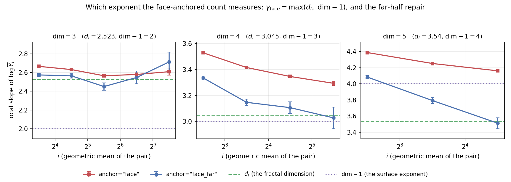

# 05_percolation_highd — Site percolation on $\mathbb Z^{\text{dim}}$, dimension as a parameter

**Status: H0 (criticality) passes for $d=3,4,5$, inconclusive at $d=6$; H1 (cost model)
passes for $d=3,4,5$; H2 passes and is the main result; H5 passes at $d=3$ including its
design-constant check, with $d\ge6$ (the exact $\tau=5/2$) still to run. H3, H4 and H6
are designed and recipe'd but not run.**

**The headline.** Generalizing ground rule 7's face-anchored observable to
$\mathbb Z^{d}$ shows it measures $\max(d_f,\,d-1)$ — so it stops measuring the fractal
dimension at $d=5$. `anchor="face_far"` (the far half of the box only) repairs it, and
the two anchors converge to *different numbers* in five dimensions, each to the one
predicted: $3.512\pm0.068$ against $d_f = 3.54$, and $4.160\pm0.009$ heading to
$d-1 = 4$. The wrong answer is the one measured $7\times$ more precisely.

Simulators: `models/percolation_zd.py` (`MODELS["percolation_zd"]`) and
`models/percolation_tau_zd.py` (`MODELS["percolation_tau_zd"]`) — `models/percolation2d.py`
and `models/percolation_tau.py` with the spatial dimension moved out of the filename and
into `params["dim"]`. Driven by the shared scripts, so this folder holds only recipes,
this README, `data/` (gitignored) and `images/`.

**The generalization is verified against the thing it generalizes**: at `dim = 2` both
models reproduce their 2-D originals *bit for bit* at the same seed, for every anchor,
geometry and observable (`test_matches_percolation2d_bit_for_bit`,
`test_matches_percolation_tau_bit_for_bit`). So every measured number in
`experiments/03_percolation_zd/README.md` still describes this code path too, and this
folder is an extension of that one rather than a fork of it.

## Why the dimension is worth making a parameter

Article Assumption 7 is $\mathrm{cost}(i) = i^{d}$, and the whole budget-allocation
theory is built on that $d$: the optimal allocation $n_i \propto i^{-d/2}$ (eq. 945–946),
the error-decay rate $-\omega_1/(d+2\omega_1)$ (checkpoint 0.5), the feasibility
condition. Until now $d$ was $0$ (`synthetic`, a formula), $1$ (`srw`, $\Theta(k)$ steps)
or $2$ (`percolation2d`, $i^2$ sites) — three fixed points, one per model.

Here `cost_hint(i) = i**dim` **exactly**, so *the article's cost exponent is the spatial
dimension*, and one recipe field sweeps $d = 2,3,4,5,6$ on the same simulator, the same
observable and the same estimator. That is the setting the allocation theory was written
for and has never been tested in.

## The observable, and the first thing the generalization showed

Ground rule 7 fixes $Y_i$ as the count of open sites connected to a full **face** of the
box. In $\mathrm{dim}$ dimensions the face is the slab $x_0 = 0$, and the 2-D derivation
generalizes literally:

$$\mathbb E Y_i \;\asymp\; \sum_{h=1}^{i} i^{\,\mathrm{dim}-1}\,\min\!\big(1,\pi_1(h)\big),
\qquad \pi_1(h)\asymp h^{-\beta/\nu},\quad \beta/\nu = \mathrm{dim}-d_f,$$

since the $i^{\mathrm{dim}-1}$ sites at depth $h$ reach the face with probability of the
order of the bulk one-arm probability (reach distance $h$, then hit a full hyperplane
with conditional probability bounded below). The sum has two regimes — dominated by
$h\sim i$ when $\beta/\nu<1$, by $h=O(1)$ when $\beta/\nu>1$ — so

$$\boxed{\ \gamma_{\text{face}} \;=\; \max\big(d_f,\ \mathrm{dim}-1\big)\ }$$

| $\mathrm{dim}$ | 2 | 3 | 4 | 5 | 6+ |
|---|---|---|---|---|---|
| $\beta/\nu$ | 0.104 | 0.477 | 0.955 | 1.46 | 2 |
| $d_f$ | 1.896 | 2.523 | 3.045 | 3.54 | **4** |
| $\mathrm{dim}-1$ | 1 | 2 | 3 | 4 | 5 |
| $\gamma_{\text{face}}$ | $d_f$ | $d_f$ | $d_f$ (marginal) | $\mathbf{4}$ | $\mathbf{5}$ |

**Ground rule 7's observable measures $d_f$ only up to $\mathrm{dim}=4$.** From
$\mathrm{dim}=5$ on the count degenerates into "open sites near the face", of which there
are $\sim i^{\mathrm{dim}-1}$, and it reports the trivial surface exponent instead — $4$
where $d_f = 3.54$, $5$ where $d_f = 4$. And $\mathrm{dim}=4$ is marginal on its own
terms: $\beta/\nu = 0.955$, so $\sum_h h^{-0.955}$ is nearly $\log i$ and the two
candidate exponents ($3.045$ and $3$) are $0.045$ apart.

That is a statement about the *observable*, not about the estimator, and it is the same
kind of statement `experiments/03_percolation_zd` P3 made about the origin anchor — with
the sign reversed, because here it is the ground-rule observable that fails.

### `anchor="face_far"` — the repair

Count only the sites in the far half, $x_0 \ge \lfloor i/2\rfloor$. The same sum then runs
over $h\in[i/2,i)$ and gives $i^{\mathrm{dim}-1}\cdot i\cdot i^{-\beta/\nu} = i^{d_f}$ in
**every** dimension. It keeps both properties that made the face anchor beat the origin
anchor in 2-D:

- **Assumption 6 holds.** The count is a sum over $\sim i^{\mathrm{dim}-1}$ transverse
  columns that decorrelate beyond the correlation length, so $\mathrm{Var}(\xi_i) = O(1)$
  — unlike the origin anchor, whose $\mathrm{Var}(\xi_i)\asymp 1/\pi_1(i)\to\infty$.
- **Assumption 2 fails at a rate that *decays*.** $Y_i = 0$ is the event that nothing
  connected to the face reaches half the box. The prediction was an $O(1)$ constant —
  bad but harmless, unlike the origin anchor's rate tending to $1$. Measured on the H2
  runs it is better than that, and better the higher the dimension:

  | fraction of draws with $Y_i = 0$ | smallest rung $\longrightarrow$ largest |
  |---|---|
  | $\mathrm{dim}=3$, $i = 8\ldots256$ | 0.231, 0.120, 0.067, 0.060, 0.048, **0.033** |
  | $\mathrm{dim}=4$, $i = 4\ldots64$ | 0.348, 0.070, 0.009, 0.001, **0.000** |
  | $\mathrm{dim}=5$, $i = 4\ldots32$ | 0.171, 0.001, 0.000, **0.000** |

  The same mechanism that breaks the cylinder criticality check in H0 helps here: more
  transverse directions mean more nearly independent chances to cross, so the
  face-connected cluster essentially always reaches half the box once
  $\mathrm{dim}\ge4$. (`anchor="face"` has a zero fraction of exactly $0.000$ everywhere,
  as `zero_rate` says it must — $(1-p_c)^{i^{\mathrm{dim}-1}}$ is $10^{-168}$ already at
  $\mathrm{dim}=3$, $i=32$.)

The price is noise: cutting the box in half throws away the least noisy part of the
count, and the measured $\mathrm{cv}$ is about $2\times$ the face anchor's. H3 below is
where that trade is scored.

## Known values — acceptance criteria, not inputs

| object | value | source |
|---|---|---|
| $d_f$ | $2.523\ (d{=}3)$, $3.045\ (4)$, $3.54\ (5)$, $\mathbf{4}$ exactly $(\ge 6)$ | $d - \beta/\nu$; mean field above $d_c = 6$ |
| $\tau = 1 + \mathrm{dim}/d_f$ | $2.189\ (3)$, $2.313\ (4)$, $2.412\ (5)$, $\mathbf{5/2}$ exactly $(\ge6)$ | hyperscaling; Stauffer & Aharony |
| $d$ (cost exponent) | $=\mathrm{dim}$ exactly | $i^{\mathrm{dim}}$ sites drawn, one union-find pass |
| $p_c$ | per dimension, `P_C_SITE_HYPERCUBIC` | Jacobsen (2015) at $d{=}2$; Xu et al. (2014) at $d{=}3$; Mertens & Moore (2018) for $d\ge4$ |
| $\omega_1$ | **not assumed** | measured here, and with only one estimator (see H2) |

Following the decision made for `srw` and carried through every real model since (user,
2026-08-20; `plans/three_experiment_ladder.md` D1/D2), **none of the exponents is wired
into the code**: neither model declares a `target_fn` or a `true_gamma_key`, so
`plot_loglog.py` overlays no reference curve. They enter as `--expect-gamma` / `--truth`
at *reporting* time only. `cost_hint` is the one exception and is not the same kind of
thing: a declared **cost**, an input to the allocation, reaching no estimator of $\gamma$.

**$p_c$ is different from all of these, and is the one real new risk.** It is an *input*,
not a criterion — a wrong entry simulates an off-critical system, and a slightly
supercritical lattice still gives a clean power law with the wrong exponent, which no
estimator in this repo can see. Hence H0.

---

## Experiment H0 — is the tabulated $p_c$ the critical point?

```bash
python3 src/estimate/check_criticality.py \
  -meta experiments/05_percolation_highd/recipes/samples_df_d3_facefar.json \
  --n 400 --scales 8 16 32 --tag criticality_d3
```

At $p_c$ the probability that some cluster spans the box along $x_0$ is asymptotically
independent of the box side; below it decays to $0$, above it rises to $1$. The driver
measures that over a ladder of sides at $p_c$ and at $p_c(1\pm\delta)$ — "flat" means
nothing without a "not flat" beside it. It **falsifies** a threshold; it does not measure
one (that needs a finite-size-scaling crossing analysis, deliberately not done here).

**Acceptance criterion:** the spanning probability at $p_c$ moves by less than $0.12$
across the ladder while both controls move past $\mp0.12$, in the right direction.

**Result (2026-09-06).** $n=400$ per (arm, scale), $\delta = 8\%$, **box geometry**:

| $\mathrm{dim}$ | ladder | below $p_c$ | at $p_c$ | above $p_c$ | verdict |
|---|---|---|---|---|---|
| 3 | 8, 16, 32 | $-0.165$ | $\mathbf{-0.030}$ | $+0.453$ | **PASS** |
| 4 | 6, 10, 16 | $-0.122$ | $\mathbf{-0.035}$ | $+0.425$ | **PASS** |
| 5 | 4, 6, 10 | $-0.160$ | $\mathbf{+0.065}$ | $+0.365$ | **PASS** |
| 6 | 6, 9, 13 | $-0.277$ | $+0.157$ | $+0.233$ | **inconclusive** |

So the table is consistent with criticality through $\mathrm{dim}=5$. At $\mathrm{dim}=6$
the $p_c$ arm's drift is $57\%$–$67\%$ of the controls' rather than near zero: the
spanning probability's *own* finite-size correction is large at the box sides six
dimensions can afford ($i\le13$), and at and above the upper critical dimension flatness
at $p_c$ stops being the right criterion anyway. **$p_c(6)$ and above rest on Mertens &
Moore (2018) alone**, and that is recorded rather than papered over.

### Run H0 on the box, not on the cylinder

The sampling runs below use `geometry = "cylinder"`, so the obvious thing is to check
criticality there too. It does not work, increasingly badly with dimension:

| $\mathrm{dim}$ | drift at $p_c$, box | drift at $p_c$, cylinder |
|---|---|---|
| 3 | $-0.030$ | $+0.040$ |
| 4 | $-0.035$ | $+0.113$ |
| 5 | $+0.065$ | $\mathbf{+0.323}$ (FAIL) |

With $\mathrm{dim}-1$ periodic transverse directions, a bigger box offers more nearly
independent transverse channels, so the probability that *some* channel spans rises with
$i$ even at $p_c$. The effect is invisible in 2-D (one periodic direction) and dominant
by five. The cylinder remains the right geometry for *sampling* — it removes the
transverse walls, which are pure contamination for a face-anchored count — and the wrong
one for this diagnostic.

---

## Experiment H1 — cost model: is $\mathrm{cost}(i) = i^{\mathrm{dim}}$?

```bash
python3 src/estimate/measure_cost.py -meta experiments/05_percolation_highd/recipes/cost_percolation_zd_d3.json --tag cost_d3
```

**Acceptance criterion:** affine $\hat d$ within the driver's 20% of the declared
$\mathrm{dim}$.

**Result (2026-09-06, PASS at every dimension — with a trend worth naming).**

| model | ladder | pure power | **affine $a+b\,i^d$** | overhead $a$ | declared | gap |
|---|---|---|---|---|---|---|
| `percolation_zd`, $\mathrm{dim}=3$ | $8..256$ | 2.458 | $\mathbf{2.934\pm0.016}$ | $196\,\mu s$ | 3 | $-2.2\%$ |
| `percolation_zd`, $\mathrm{dim}=4$ | $4..64$ | 3.095 | $\mathbf{3.809\pm0.030}$ | $222\,\mu s$ | 4 | $-4.8\%$ |
| `percolation_zd`, $\mathrm{dim}=5$ | $3..32$ | 3.879 | $\mathbf{4.620\pm0.042}$ | $269\,\mu s$ | 5 | $-7.6\%$ |
| `percolation_tau_zd`, $\mathrm{dim}=3$ | $16..4096$ | 1.113 | $\mathbf{1.175\pm0.010}$ | $248\,\mu s$ | 1.206 | $-2.6\%$ |

`experiments/01_srw`'s lesson transfers unchanged — the pure-power fit is badly low and
the affine one recovers $d$ — but a **new** effect appears on top of it: the shortfall
grows monotonically with dimension, and at $\mathrm{dim}=5$ the driver flags DISAGREE at
$9.1\sigma$ even while PASSing on the relative tolerance.

The cause is not the model. It is that **the affordable probe ladder shrinks as $i^{d}$
grows** — $8\ldots256$ at $\mathrm{dim}=3$ but only $3\ldots32$ at $\mathrm{dim}=5$ —
while the fixed $\approx200$–$270\,\mu s$ of Python/NumPy dispatch does not. At
$\mathrm{dim}=4$ that overhead is $95\%$ of the measurement at the bottom rung. The
affine fit is doing its job, on a short lever arm. Fixing it means probing higher, which
means raising `_DEFAULT_WORKING_SET_BYTES` — recorded as open rather than tuned away,
because $\hat d$ is not what any allocation here uses (the *declared* `cost_hint` is).

---

## Experiment H2 — $\hat d_f$ per dimension, and which anchor measures it

```bash
python3 src/generate/generate.py -meta experiments/05_percolation_highd/recipes/samples_df_d3_facefar.json --tag df_d3_facefar
python3 src/estimate/estimate_omega1.py -data experiments/05_percolation_highd/data/df_d3_facefar --expect-gamma 2.523
```

Budget $4\times10^{9}$ work units (= sites) per run, split by `neyman` — which needs no
design constant, since $d = \mathrm{dim}$ comes from the model's own `cost_hint`.
Geometry `cylinder`, ladders powers of two, capped by memory: one sample at
$(\mathrm{dim},i) = (3,256)$ is $16.8$ M sites and at $(5,32)$ is $33.5$ M.

**Acceptance criterion:** $\hat\gamma$ within the driver's 15% of $d_f(\mathrm{dim})$,
and the ordering `face_far` closer than `face`, growing with dimension.

**Result (2026-09-06, PASS — and $\mathrm{dim}=5$ settles it).** The article's own
estimator (the weighted OLS of eq. 523–531, `gamma_drop_leading`), dropping the $m_0$
smallest rungs:

| $\mathrm{dim}$ | anchor | $m_0=0$ | 1 | 2 | 3 | 4 | $d_f$ | $\mathrm{dim}-1$ |
|---|---|---|---|---|---|---|---|---|
| 3 | `face_far` | **2.5541** | 2.5551 | 2.5684 | 2.6309 | 2.7144 | 2.523 | 2 |
| 3 | `face` | 2.6044 | 2.5917 | 2.5843 | **2.5945** | 2.6093 | 2.523 | 2 |
| 4 | `face_far` | 3.1486 | 3.0949 | 3.0669 | **3.0274** | — | 3.045 | 3 |
| 4 | `face` | 3.3930 | 3.3513 | 3.3200 | **3.2937** | — | 3.045 | 3 |
| 5 | `face_far` | 3.7952 | 3.6520 | **3.5119** | — | — | **3.54** | 4 |
| 5 | `face` | 4.2645 | 4.2057 | **4.1604** | — | — | 3.54 | **4** |

and the local slopes, with the standard error of each:

| $\mathrm{dim}=5$, $i$ | $4\!\to\!8$ | $8\!\to\!16$ | $16\!\to\!32$ |
|---|---|---|---|
| `face` | $4.387\pm0.006$ | $4.251\pm0.007$ | $\mathbf{4.160\pm0.009}$ |
| `face_far` | $4.083\pm0.021$ | $3.792\pm0.036$ | $\mathbf{3.512\pm0.068}$ |

**In five dimensions the two anchors converge to different numbers, and each converges to
the one predicted.** `face_far`'s last local slope is $3.512\pm0.068$ against
$d_f = 3.54$: within $0.4$ statistical standard errors. `face`'s is $4.160\pm0.009$,
$0.62$ above $d_f$ — seventy times its own error bar — and still descending toward
$\mathrm{dim}-1 = 4$ from above, which is where the derivation puts it. (Those error bars
are statistical only; a local slope also carries a correction-to-scaling term, so the
right reading is the *direction each sequence is moving in*, not a $\sigma$ count against
an asymptotic value.)



*`images/anchor_local_slopes.png` — the local slope of $\log\overline Y_i$ against $i$,
both anchors, all three dimensions, with the two candidate exponents drawn in. Left to
right the two candidates pull apart ($0.52$, $0.045$, $0.46$) and the two anchors do too.
The $\mathrm{dim}=4$ panel is the near-degenerate one: both exponents sit inside the same
$0.05$ band, and `face_far` reaches it while `face` does not. The $\mathrm{dim}=5$ panel
is the decisive one: `face_far` descends through the surface exponent and lands on
$d_f$; `face` never crosses it.*

This is not a precision gap. The two observables are measuring different exponents,
exactly as $\gamma_{\text{face}} = \max(d_f, \mathrm{dim}-1)$ says, and $\mathrm{dim}=5$
is the first dimension where those two numbers are far enough apart ($0.46$, against
$0.045$ at $\mathrm{dim}=4$) for a ladder this short to tell them apart. Note which one
is better measured: the *wrong* answer comes with an error bar $7\times$ smaller, because
a count dominated by $i^{\mathrm{dim}-1}$ nearly independent boundary clusters is a very
stable thing to average.

The four-parameter direct fit of eq. (232) agrees where it can be run at all
($\ge5$ rungs, so $\mathrm{dim}\le4$):

| $\mathrm{dim}$ | anchor | $\hat\gamma$ | vs $d_f$ | $\hat\omega_1$ | rel_rmse |
|---|---|---|---|---|---|
| 3 | **`face_far`** | $\mathbf{2.5295}$ | $\mathbf{+0.26\%}$ | 2.34 | $4.6\times10^{-2}$ |
| 3 | `face` | $2.5591$ | $+1.43\%$ | 0.89 | $1.0\times10^{-2}$ |
| 4 | **`face_far`** | $\mathbf{3.0501}$ | $\mathbf{+0.17\%}$ | 1.49 | $8.0\times10^{-3}$ |
| 4 | `face` | $3.2102$ | $+5.42\%$ | 0.63 | $7.2\times10^{-4}$ |
| 5 | either | — | — | — | *unavailable: 4 rungs, needs 5* |

`face_far` lands within $0.3\%$ of $d_f$ in both dimensions where the fit runs, and the
gap between the anchors widens from $1.4\%$ to $5.4\%$ to a different exponent
altogether. And note the trap in the rel_rmse column: `face`'s $\mathrm{dim}=4$ fit has
the **smallest residual of any run here** ($7.2\times10^{-4}$) while being $5.4\%$ wrong.
A clean power law fitted to the wrong observable is still a clean power law.

The local slopes at the two lower dimensions show the same mechanism more slowly:

| $\mathrm{dim}=3$, $i$ | $8\!\to\!16$ | $16\!\to\!32$ | $32\!\to\!64$ | $64\!\to\!128$ | $128\!\to\!256$ |
|---|---|---|---|---|---|
| `face` | 2.666 | 2.632 | 2.565 | 2.580 | 2.609 |
| `face_far` | 2.574 | 2.564 | 2.450 | 2.547 | 2.714 |

| $\mathrm{dim}=4$, $i$ | $4\!\to\!8$ | $8\!\to\!16$ | $16\!\to\!32$ | $32\!\to\!64$ |
|---|---|---|---|---|
| `face` | 3.529 | 3.415 | 3.346 | **3.294** |
| `face_far` | 3.336 | 3.147 | 3.106 | **3.027** |

At $\mathrm{dim}=3$ the two are only $0.05$–$0.1$ apart and the top rungs are noisy
(the $128\!\to\!256$ slope carries $\pm0.104$, since `neyman` leaves $n=154$ there) —
which is why `face_far`'s drop-leading ladder *rises* at large $m_0$ rather than settling.
At $\mathrm{dim}=4$ they separate cleanly, `face_far` straddling $d_f = 3.045$ while
`face` is still at $3.294$ and falling slowly, the marginal $\beta/\nu = 0.955$ producing
a near-logarithmic correction that a one-correction model reads as a raised exponent.
**The prediction that ground rule 7's observable degrades with dimension is what the data
show, in the dimension where the theory says the degradation begins and in the dimension
where it says it is complete.**

### Assumption 6, and the price of the repair

Coefficient of variation along the ladder:

| | $\mathrm{dim}=3$, $i=8\to256$ | log-log slope | $\mathrm{dim}=4$, $i=4\to64$ | slope |
|---|---|---|---|---|
| `face` | $0.447 \to 0.282$ | $-0.13$ | $0.466\to0.130$ | $-0.46$ |
| `face_far` | $0.995 \to 0.742$ | $-0.08$ | $1.212\to0.680$ | $-0.21$ |

Both decrease, so Assumption 6 is satisfied in the safe direction in both dimensions —
this is not the origin anchor's growing $\mathrm{cv}$. But `face_far` is $2$–$2.6\times$
noisier at every rung, which is the honest cost of discarding half the box, and `face`'s
$\mathrm{cv}$ decays *faster* — consistent with an increasing share of its count coming
from many nearly independent boundary-layer clusters, which is the same degeneracy the
exponent is reporting. **A shrinking $\mathrm{cv}$ is not automatically good news: here it
is the signature of the observable going trivial.**

### $\omega_1$ has only one estimator above $\mathrm{dim}=2$

`estimate_omega1.py`'s bias-decay fit needs 4 drop-leading windows of $\ge4$ scales, i.e.
$\ge7$ rungs. Memory caps the ladder at 6 rungs in $\mathrm{dim}=3$, 5 in $4$, 4 in $5$,
so it errors out (`only 3 windows with >= 4 scales`) and only the direct fit of eq. (232)
reports. Two independent estimators disagreeing is what the 2-D rung used to catch a bad
$\omega_1$ (`experiments/03_percolation_zd` P2/P4); **that check is unavailable here**,
and the $\hat\omega_1$ column above should be read as a shape parameter of a
four-parameter fit on a short window, not as a measurement. Widening the ladder is the
prerequisite, and it is the same prerequisite the 2-D rung has had open since P2.

---

## Experiment H3 — `face` vs `face_far` at equal budget, and where they diverge

H2 ran the two anchors as separate deep runs. H3 is the head-to-head with replicates and
error bars, the shape `experiments/03_percolation_zd` P3/P4 established: identical
scales, identical $n$, identical cost, differing only in `params["anchor"]`, $R$
independent full experiments per arm, scored as bias / sd / RMSE against $d_f$.

```bash
python3 src/estimate/compare_observables.py \
  --arm face=experiments/05_percolation_highd/recipes/samples_anchor_d3_face.json \
  --arm face_far=experiments/05_percolation_highd/recipes/samples_anchor_d3_facefar.json \
  --arm origin=experiments/05_percolation_highd/recipes/samples_anchor_d3_origin.json \
  --replicates 12 --truth 2.523 --seed 20260906 --tag compare_anchor_d3

python3 src/estimate/compare_observables.py \
  --arm face=experiments/05_percolation_highd/recipes/samples_anchor_d5_face.json \
  --arm face_far=experiments/05_percolation_highd/recipes/samples_anchor_d5_facefar.json \
  --replicates 12 --truth 3.54 --seed 20260906 --tag compare_anchor_d5
```

**Acceptance criteria.** (a) `face_far`'s RMSE against $d_f$ is smaller in $\mathrm{dim}=3$;
(b) in $\mathrm{dim}=5$ `face` is scored against $\mathrm{dim}-1 = 4$ as well as against
$d_f$, and is *closer to $4$* — the whole prediction being that it measures the wrong
exponent rather than measuring the right one badly; (c) the report states whether each
cell is bias- or variance-limited.

The $\mathrm{dim}=5$ arm is the sharp test, because there the two candidate exponents are
$0.46$ apart rather than $0.045$: it separates "ground rule 7's observable is noisy in
high $d$" from "ground rule 7's observable answers a different question in high $d$".

**Status: not yet run.** H2's deep single runs already point the same way — see the
$\mathrm{dim}=5$ local slopes below — but a single replicate with no error bars is not a
measurement, which is the lesson `experiments/03_percolation_zd` P3 recorded when a
four-parameter fit landed the *origin* arm nearest the truth once, by accident.

---

## Experiment H4 — cylinder vs box in high $d$

In 2-D, dropping the two transverse walls was worth $3.7\times$ in RMSE at $1.04\times$
the cost (`experiments/03_percolation_zd` P4). In $\mathrm{dim}$ dimensions a box has
$2\,\mathrm{dim}$ walls and a cylinder has $2$, so the same argument says the gain should
*grow* with dimension — while the wrap-merge cost grows too, since $\mathrm{dim}-1$ pairs
of faces are joined instead of one.

```bash
python3 src/estimate/compare_observables.py \
  --arm box=experiments/05_percolation_highd/recipes/samples_geom_d3_box.json \
  --arm cylinder=experiments/05_percolation_highd/recipes/samples_geom_d3_cylinder.json \
  --replicates 12 --truth 2.523 --seed 20260906 --tag compare_geom_d3
```

**Acceptance criteria.** (a) the cylinder's RMSE is smaller; (b) the reduction is in the
*bias*; (c) the cost overhead stays under $1.15\times$ and the measured $d$ is unchanged.

**Status: not yet run.**

---

## Experiment H5 — $\tau$ per dimension, and the first exact target in this repo

`models/percolation_tau_zd.py`, ladder in **cluster size** $s$, $\gamma = 1-\tau$ with
$\tau = 1 + \mathrm{dim}/d_f$ — so $\hat\tau = 1 - \hat\gamma$ at reporting time.

```bash
python3 src/generate/generate.py -meta experiments/05_percolation_highd/recipes/samples_tau_d3.json --tag tau_d3
python3 src/estimate/estimate_omega1.py -data experiments/05_percolation_highd/data/tau_d3 --expect-gamma -1.18906
```

**Above $\mathrm{dim} = 6$ this is the first rung in the project with an exact target on
a real process.** $\tau = 5/2$ and $d_f = 4$ are mean-field values, not literature
best-fits: $\gamma = -3/2$ exactly. Every other real model here is scored against a
number someone else measured (`percolation2d`'s $91/48$ is exact, but $\omega_1$ is not),
and the only exact targets so far were `synthetic`'s planted ones.

Two design points, both forced by the generalization and both stated in
`models/percolation_tau_zd.py`:

- **`box_exponent` defaults to $1/d_f$, not $1/\mathrm{dim}$.** The 2-D model's $1/2$ is
  $1/\mathrm{dim}$ there, and its cutoff drift $1 - d_f/\mathrm{dim} = 5/96$ is
  negligible only in two dimensions — it is $0.159$ at $\mathrm{dim}=3$ and $1/3$ at
  $\mathrm{dim}=6$. Freezing the ratio needs $d_f$ as a **design** constant (`DF_LOWER`),
  which never reaches an estimator. Its consequence: the cost exponent is
  $d = \mathrm{dim}/d_f = \tau - 1 = -\gamma$, so the article's cost exponent and the
  exponent being measured are the same number.
- **`box_factor` is $256^{1/\mathrm{dim}}$**, holding `box_factor**dim` — the lattice
  sites in one allocation budget unit, i.e. `cost_unit_ratio` — fixed at the 2-D value.
  So *"ask for $S/256$ to spend $S$ sites"* reads the same in every dimension, and the
  unit trap that once made `plan.py` predict $740$ s for a $42$-hour run does not acquire
  a per-dimension footnote.

  **That intent does not survive the `ceil`, and the failure grows with dimension.**
  $L(s) = \lceil\texttt{box\_factor}\cdot s^{\texttt{box\_exponent}}\rceil$ is only
  asymptotically a power law, and `box_factor` shrinks as $256^{1/\mathrm{dim}}$, so in
  high dimension $L$ is small ($5\ldots15$ at $\mathrm{dim}=6$) and the rounding is a
  large relative cost. Measured on the ladder $s = 8\ldots1024$ under the `neyman`
  allocation each dimension actually gets:

  | $\mathrm{dim}$ | 2 | 3 | 4 | 5 | 6 | 7 |
  |---|---|---|---|---|---|---|
  | $L$ range | 50–679 | 15–106 | 9–41 | 6–23 | 5–15 | 4–13 |
  | true `cost_unit_ratio` | 264 | 277 | 434 | 413 | **1031** | 675 |

  So "one budget unit is 256 sites" holds to $8\%$ at $\mathrm{dim}=2$–$3$ and is a
  **$4\times$ under-estimate at $\mathrm{dim}=6$**. This bit in practice: the
  $\mathrm{dim}=6$ run below was written for $4\times10^{9}$ sites on that rule and is
  actually $1.61\times10^{10}$ — 43 CPU-minutes instead of 10.

  Nothing downstream is wrong, because nothing downstream uses the nominal number:
  `tools/cost_model.cost_unit_ratio` computes the ratio exactly for the ladder and counts
  in hand, `ceil` included, and `src/study/plan.py` bisects on predicted *seconds* rather
  than multiplying by a throughput. It is the **hand-written `budget` in a recipe** that
  is off, which is the same shape as the trap that once made the planner predict $740$ s
  for a $42$-hour run — surviving in the one place that is still a human's arithmetic.
  Read `cost_unit_ratio` for the ladder before writing a high-$\mathrm{dim}$ budget.

**Acceptance criteria.** (a) $\hat\tau$ within $2\%$ of $1 + \mathrm{dim}/d_f$ at
$\mathrm{dim} = 3,4,5$; (b) within $1\%$ of $5/2$ at $\mathrm{dim} = 6$ and $7$, where the
target is exact; (c) $\hat\tau$ unchanged (within its error bar) between
`samples_tau_d3.json` and `samples_tau_d3_boxexp_half.json`, which differ only in
`box_exponent` — the test that `DF_LOWER` is a design constant and not an input.

**Cost model, measured (2026-09-06, PASS):** affine $\hat d = 1.1748\pm0.0100$ over
$s = 16\ldots4096$ at $\mathrm{dim}=3$, against the model's declared $1.2060$ — $2.6\%$,
inside the driver's $20\%$ tolerance, with the usual small-scale story (pure-power
$1.113$; overhead $34\%$ of the measurement at $s=16$). The declared value is
`declared_exponent`'s OLS over that same ladder rather than the exact asymptote
$\mathrm{dim}/d_f^{-} = 3/2.47 = 1.2146$: `box_side`'s `ceil` makes $\mathrm{cost}(s)$ a
power law only asymptotically, and comparing the clock against the exponent the ladder
*actually has* is the point of computing it that way.

**Result, $\mathrm{dim}=3$ (2026-09-06, PASS).** Budget $1.5625\times10^{7}$ allocation
units, which the $\times277$ measured conversion above turns into $4.33\times10^{9}$
lattice sites actually drawn, ladder
$s = 8\ldots1024$ (8 rungs), torus, `bin`. The article's own estimator:

| $m_0$ | 0 | 1 | 2 | 3 | 4 | 5 | 6 |
|---|---|---|---|---|---|---|---|
| $\hat\tau = 1-\hat\gamma$ | 2.1543 | 2.1620 | 2.1691 | 2.1759 | 2.1811 | **2.1860** | **2.1946** |

against $\tau(3) = 1 + 3/2.523 = 2.18906$: it climbs monotonically as the contaminated
small rungs are dropped and **straddles the target** at $m_0 = 5,6$ ($-0.14\%$,
$+0.25\%$). Local slopes $-1.105, -1.126, -1.139, -1.160, -1.172, -1.177, -1.195$
(each $\pm0.005$–$0.018$), converging on $\gamma = -1.18906$ from above.

Two things are *better* here than on the $d_f$ ladder, and both come from the box being
tied to the rung rather than to the estimator's scale:

- **Assumption 6 is cleanly satisfied**: $\mathrm{cv} = 0.384, 0.362, 0.368, 0.342,
  0.337, 0.350, 0.340, 0.341$ — flat to $\pm6\%$ over seven doublings, and *quieter*
  than the 2-D run's $0.578$–$0.617$.
- **Both $\omega_1$ estimators run and agree**, differing by $0.030$ — the check H2 loses
  above $\mathrm{dim}=2$ for want of rungs. They report $\hat\omega_1 \approx 0.16$–$0.19$,
  a very slowly decaying correction, and correspondingly both four-parameter fits
  *overshoot* ($\hat\tau = 2.267$ direct, $2.231$ bias-decay) where the article's
  drop-leading estimator lands on the target. Same pattern as the 2-D rung: a tiny
  $\hat\omega_1$ makes the extrapolation to $i=\infty$ unreliable, and the estimator that
  *drops* the correction beats the ones that model it.

**Result, H5(c) — `DF_LOWER` is a design constant, not an input (2026-09-06, PASS).**
Two runs at the same budget, the same ladder and the same seed, differing only in
`box_exponent`: the dimension-aware default $1/d_f^{-} = 1/2.47 = 0.4049$ against the 2-D
model's $1/2$. On the rungs they share ($s = 8\ldots512$):

| $m_0$ | 0 | 1 | 2 | 3 | 4 | 5 |
|---|---|---|---|---|---|---|
| $\hat\tau$, `box_exponent` $=0.4049$ | 2.1475 | 2.1555 | 2.1629 | 2.1702 | 2.1750 | 2.1775 |
| $\hat\tau$, `box_exponent` $=0.5$ | 2.1497 | 2.1582 | 2.1656 | 2.1711 | 2.1839 | 2.1921 |
| difference | 0.0022 | 0.0027 | 0.0027 | 0.0009 | 0.0089 | 0.0146 |

**The fitted exponent does not move**: the two arms agree to $0.003$ wherever the estimate
is well conditioned ($m_0 \le 3$), and diverge only at the top of the drop-leading ladder
where each is fitting three or four rungs. What *does* move is exactly what a design
constant is allowed to move — the noise and the cost:

| | $\mathrm{cv}$, $s = 8\to512$ | cost exponent $d$ | $n$ at $s=512$ |
|---|---|---|---|
| `box_exponent` $=0.4049$ | $0.384\to0.340$ (flat) | 1.21 | 1971 |
| `box_exponent` $=0.5$ | $0.290\to0.148$ (falling) | 1.50 | 581 |

$0.5 > 1/d_f$ makes the box grow *faster* than the cutoff needs, so each lattice holds
more clusters and is quieter — and costs enough more that the same budget buys a third as
many samples at the top rung. The default trades that for a flat $\mathrm{cv}$, which is
what Assumption 6 asks for. Neither choice reaches the estimator, and the table above is
the evidence rather than the claim.

**Result, $\mathrm{dim}=6$ (2026-09-06, FAIL against its own criterion).** The run this
model was built for — the only *exact* target on a real process in this repo — and it does
not reach it. Same ladder $s = 8\ldots1024$, torus, `bin`:

| $m_0$ | 0 | 1 | 2 | 3 | 4 | 5 | 6 |
|---|---|---|---|---|---|---|---|
| $\hat\tau$ | 2.4121 | 2.4176 | 2.4239 | 2.4318 | 2.4424 | **2.4604** | 2.4483 |

against $\tau = 5/2$ **exactly**: $-1.6\%$ at $m_0=5$, outside criterion (b)'s $1\%$. It is
climbing monotonically and has not flattened, and the cv is $0.24$–$0.28$ and flat, so
this is bias, not noise — the estimator is behaving, the *design* is not asymptotic. Both
four-parameter fits are useless here ($\hat\tau = 2.87$ with $\hat\omega_1 = 0.032$
direct; $13.2$ from the bias decay), which is what fitting a correction that has not
decayed over the window looks like.

The likely cause is the box: `box_factor` $=256^{1/6} = 2.52$ gives $L = 5\ldots15$, a
handful of correlation lengths, and $\mathrm{dim}=6$ is *exactly* the upper critical
dimension, where logarithmic corrections are expected on top of everything else. Two
things to try, in order: a larger `box_factor` (more sites per lattice, fewer lattices —
nearly free in precision per unit budget, see the 2-D calibration), and
$\mathrm{dim}=7$ (`samples_tau_d7.json`), which has the same exact target *without*
sitting on $d_c$.

**This is the run that cost $1.61\times10^{10}$ sites instead of the $4\times10^9$ its
recipe appears to ask for** — see the `cost_unit_ratio` caveat above. 43 CPU-minutes.

---

## Experiment H6 — the shared-lattice sampler in high $d$

`shared_sampler` draws the whole ladder from one box sized by the top rung. In 2-D that
was $3.2\times$ cheaper *and* closer to $\tau$ at every $m_0$, at the price of a flat
$\approx+0.11$ correlation pedestal across rungs — benign for this estimator, whose
weights sum to zero (`experiments/03_percolation_zd`).

```bash
python3 src/generate/generate_shared.py -meta experiments/05_percolation_highd/recipes/samples_tau_d3_shared.json --tag tau_d3_shared
```

The saving should **grow** with dimension: the per-rung sampler pays
$\sum_k n_k L(s_k)^{\mathrm{dim}}$ and $L^{\mathrm{dim}}$ grows faster the higher
$\mathrm{dim}$ is. Two things need re-checking rather than assuming, and that is what
this experiment is:

- **`DEFAULT_CUT_FRACTION = 0.05` was calibrated in 2-D.** It bounds the dimensionless
  ratio $s/L^{d_f}$, which the 2-D calibration showed the cutoff is a function of — so
  the transfer is principled, but it is a transfer. Redo the "hold one bin fixed, grow
  $L$, watch $\overline Y_s$ converge" measurement at $\mathrm{dim}=3$.
- **Whether the correlation pedestal stays flat in lag.** A common mode cancels from the
  slope; a lag-decaying correlation does not, and it is the case the user flagged as the
  interesting one ("I still believe the estimator works, with some modification, when the
  correlation decays polynomially or faster").

**Acceptance criteria.** (a) the per-site $\overline Y_s$ plateau at $\mathrm{dim}=3$ is
reached by $s/L^{d_f^-} \le 0.05$ with bias under the noise floor; (b) the shared and
independent runs agree on $\hat\tau$ within the covariance-corrected error bar; (c) the
cross-rung correlation is reported as a function of lag.

**Status: not yet run.**

---

---

## Experiment H7 — the seed set's dimension, and the plateau that measures $d_f$

H2 found that the face measures $\max(d_f, \mathrm{dim}-1)$: too many seeds. The origin
anchor has the opposite problem, and a sharper one than this repo believed — it measures
$\gamma/\nu = \mathrm{dim}-2\beta/\nu$, not $d_f$ (the correction is recorded in
`experiments/03_percolation_zd/README.md` and `models/percolation2d.py`). Igor,
2026-09-06: *"What about using an axis as anchor? This avoids the problem of starting
with $i^d$ seeds (you start with $i$) and also avoids the problem of starting with a
single seed, which has a decent probability of being isolated in a small cluster even if
the box is huge."*

That makes the **seed set's own dimension** the natural parameter.
`anchor="slab"` with `params["anchor_dim"] = k` seeds on the central $k$-slab: $k=0$ the
centre site, $1$ a central axis, $2$ a central plane, $\mathrm{dim}$ every site. Repeating
H2's depth sum for a $k$-slab — $i^k h^{\mathrm{dim}-k-1}$ sites at distance $h$, each
connected with probability $\pi_1(h)\,q_k(h)$ where
$q_k(h)=\min(1,h^{k-\beta/\nu})$ is the chance a cluster with $h^{d_f}$ sites in the ball
of radius $h$ meets the $h^k$ slab sites inside it — gives

$$\gamma(k)=\begin{cases}k+\gamma/\nu, & k<\beta/\nu\quad\text{(seeds too sparse)}\\
d_f, & \beta/\nu\le k\le d_f\\ k, & k>d_f\quad\text{(saturated)}\end{cases}$$

**The middle regime is a plateau in $k$, and that is what makes this a measurement rather
than a fit.** $\hat\gamma(k)$ flat across a range of $k$ *is* $d_f$; the two places it
starts to move give $\beta/\nu$ and $d_f$ as by-products. Nothing needs to be assumed to
pick $k$ — which matters, because unlike `box_exponent` or `DF_LOWER`, $k$ **is not a
design constant**: it changes the exponent being measured, so choosing it from a
literature $\beta/\nu$ would be assuming the answer. The sweep is the point.

Both familiar anchors are endpoints: $k=0$ is `"origin"` *identically* (a test —
computed by a different route), and $k=\mathrm{dim}-1$ is the bulk twin of the face.
`"face"` stays separate because it is a **boundary** object; the cylinder geometry exists
to give it its two walls, and surface and bulk need not share an exponent. $k=\mathrm{dim}$
is a free calibration point: every open site is its own seed, so $\gamma=\mathrm{dim}$
*exactly*, with no percolation in it — pinned by a test.

```bash
for k in 0 1 2; do
  python3 src/generate/generate.py -meta experiments/05_percolation_highd/recipes/samples_slab_d3_k$k.json --tag slab_d3_k$k
done
```

**Acceptance criteria.** (a) $\hat\gamma(k)$ is flat to within its error bars over
$k\in\{1,2\}$ at $\mathrm{dim}=3$ and $k\in\{2,3\}$ at $\mathrm{dim}=5$, and that plateau
value is $d_f$ to $2\%$; (b) $\hat\gamma(0)$ sits at $\gamma/\nu$, not at $d_f$;
(c) $\hat\gamma(\mathrm{dim})=\mathrm{dim}$ to float precision (the free calibration
point); (d) the cv falls monotonically in $k$, so the recommendation is the **smallest**
$k$ inside the plateau.

**Prototype result, $\mathrm{dim}=3$ (2026-09-06, $3\times10^8$ sites, local slopes over
$i=8\ldots64$).** $d_f=2.5226$, $\gamma/\nu=2.0452$:

| $k$ | | predicted | $8\to16$ | $16\to32$ | $32\to64$ |
|---|---|---|---|---|---|
| 0 | origin | 2.045 | 1.995±0.054 | 2.120±0.107 | 1.865±0.218 |
| 1 | **axis** | 2.523 | 2.575±0.016 | **2.540±0.026** | 2.576±0.040 |
| 2 | face-dim | 2.523 | 2.698±0.005 | 2.650±0.007 | 2.631±0.009 |

**The axis is the better observable at $\mathrm{dim}=3$**: bias $0.017$ against the
$k=2$ slab's $0.127$, at $\approx3.5\times$ the noise — a decisive RMSE win. And $k=0$
lands on $\gamma/\nu$, which is criterion (b) met at the first attempt and the
independent confirmation of the 2-D correction.

**Prototype result, $\mathrm{dim}=5$ ($6\times10^8$ sites, $i=4\ldots32$).**
$d_f=3.54$, $\gamma/\nu=2.08$, $\beta/\nu=1.46$:

| $k$ | predicted | $4\to8$ | $8\to16$ | $16\to32$ |
|---|---|---|---|---|
| 0 | 2.08 | 2.378±0.469 | −0.936±1.160 | 4.347±1.759 |
| 1 | 3.08 | 3.122±0.199 | 2.414±0.651 | 2.064±1.076 |
| 2 | 3.54 | 3.774±0.073 | **3.537±0.162** | 3.873±0.242 |
| 3 | 3.54 | 4.161±0.028 | 3.937±0.045 | 4.027±0.050 |
| 4 | 4.00 | 4.477±0.010 | 4.348±0.010 | **4.271±0.010** |

**This run does not settle $\mathrm{dim}=5$, and it is recorded because it does not.**
$k=2$ lands on $d_f$ and $k=4$ converges to $\mathrm{dim}-1$, so the two ends behave as
predicted. But $k=3$ should also give $3.54$ and reads $\approx4.0$ with $\pm0.05$ error
bars — a real disagreement, not noise. Either the interior of the window is wrong, or
$i\le32$ in five dimensions is nowhere near asymptotic: the sum's exponent at $k=3$ is
$-0.46$, so its crossover is very slow, the same marginality that makes $\mathrm{dim}=4$
hard for the face. And $k\in\{0,1\}$ carry errors of $\pm0.2$ to $\pm1.8$: **the
prediction that the axis fails above $\mathrm{dim}=4$ is not tested by this run.** The
full-budget recipes above are what would test it.

### Why low $k$ cannot be measured cheaply — which is itself the argument

| | $\mathrm{dim}=3$, $i=32$ | | $\mathrm{dim}=5$, $i=16$ | |
|---|---|---|---|---|
| $k$ | zero fraction | cv | zero fraction | cv |
| 0 origin | 0.698 | 3.08 | 0.873 | 11.48 |
| 1 **axis** | **0.000** | **0.66** | 0.107 | 3.19 |
| 2 plane | 0.000 | 0.16 | 0.000 | 0.89 |
| 3 | — | — | 0.000 | 0.22 |
| 4 | — | — | 0.000 | 0.05 |

Igor's premise is confirmed and is larger than it looked: **the origin is zero on 70% of
draws at $\mathrm{dim}=3$ and 87% at $\mathrm{dim}=5$**, with cv $3$–$11$. One extra seed
dimension removes it outright at $\mathrm{dim}=3$ ($0.698\to0.000$, cv $3.08\to0.66$).
That is the Assumption-2 and Assumption-6 repair, measured — and the reason $k=0,1$ are
expensive to measure is the same reason they are poor observables.

Since cv falls monotonically in $k$ while bias rises, the optimum is the smallest $k$
inside the plateau, $k^\star=\lceil\beta/\nu\rceil$ — which is $k=1$, **the axis**, for
$\mathrm{dim}=2,3,4$, and $k=2$ from $\mathrm{dim}=5$ where $\beta/\nu$ crosses $1$. But
that formula is a *conclusion* to be checked against the plateau, never an input to it.

**Status: prototype measured at $\mathrm{dim}=3$ and $5$; the full-budget sweep
(`samples_slab_d3_k*.json`, `samples_slab_d5_k*.json`) is not yet run.**

---

## Experiment H8 — $\tau$ across $\mathrm{dim} = 2\ldots8$ at equal budget

Every experiment above varies one thing at a fixed dimension. H8 varies the dimension and
holds everything else — the same model, the same observable, the same ladder, the same
estimator, and **the same number of lattice sites** — so the rows are comparable to each
other rather than only to their own acceptance values.

```bash
for d in 2 3 4 5 6 7 8; do
  python3 src/generate/generate.py -meta experiments/05_percolation_highd/recipes/samples_sweep_tau_d$d.json --tag sweep_tau_d$d
done
python3 src/report/dimension_table.py -data experiments/05_percolation_highd/data --dims 2-8
```

Three design choices, each forced:

- **The cluster-size ladder, not the box-side one.** $L(s)\propto s^{1/d_f}$ keeps boxes
  small, so the *same* 7-rung ladder $s = 8\ldots512$ fits in every dimension up to 8. A
  box-side ladder is down to 4 rungs by $\mathrm{dim}=5$ and 3 by $\mathrm{dim}=7$ (see
  "Reachable ladders"), which would make the rows incomparable by construction.
- **7 rungs, not 6.** It is the minimum that leaves 4 drop-leading windows of $\ge4$
  scales, which is what `estimate_omega1.py`'s bias-decay fit needs — so the
  correction-to-scaling exponent gets two independent estimators rather than one.
- **Equal *sites*, not equal `budget` field.** `cost_unit_ratio` runs $265 \to 1799$ over
  $\mathrm{dim}=2\ldots8$, so each recipe's budget is $8\times10^{9}$ divided by its own
  ratio. Realized: $8.00\times10^{9}$ sites for $\mathrm{dim}\le6$ and $7.97$/$7.91$ at
  $7$/$8$ (integer rounding in the allocation at small $n$). This is the trap the
  `cost_unit_ratio` caveat above exists for, applied.

**Result (2026-09-07).** $m_0 = 3$, i.e. the largest window still leaving 4 rungs:

| dim | $\hat\gamma$ | 95% CI | $\hat\tau$ | $\tau$ (lit) | err | $\hat d_f$ | $d_f$ (lit) |
|---|---|---|---|---|---|---|---|
| 2 | $-1.0407$ | $[-1.0451, -1.0363]$ | 2.0407 | 2.0549 | $-0.69\%$ | 1.9218 | 1.8958 |
| 3 | $-1.1680$ | $[-1.1727, -1.1634]$ | 2.1680 | 2.1891 | $-0.96\%$ | 2.5684 | 2.5226 |
| 4 | $-1.2828$ | $[-1.2887, -1.2769]$ | 2.2828 | 2.3138 | $-1.34\%$ | 3.1182 | 3.0446 |
| 5 | $-1.3610$ | $[-1.3690, -1.3530]$ | 2.3610 | 2.4124 | $-2.13\%$ | 3.6737 | 3.5400 |
| 6 | $-1.4250$ | $[-1.4344, -1.4156]$ | 2.4250 | $\mathbf{2.5}$ | $\mathbf{-3.00\%}$ | 4.2105 | 4.0000 |
| 7 | $-1.4595$ | $[-1.4707, -1.4482]$ | 2.4595 | $\mathbf{2.5}$ | $-1.62\%$ | — | 4.0000 |
| 8 | $-1.4840$ | $[-1.4994, -1.4687]$ | 2.4840 | $\mathbf{2.5}$ | $\mathbf{-0.64\%}$ | — | 4.0000 |

Correction-to-scaling, direct fit of eq. (232):

| dim | $a_0$ | $a_1$ | $\omega_1$ | rel_rmse | $\tau$ (fit) | |
|---|---|---|---|---|---|---|
| 2 | 0.0175 | $-0.692$ | 0.603 | $1.1\times10^{-3}$ | 2.0597 | |
| 3 | 0.0307 | $-0.671$ | 0.730 | $1.8\times10^{-3}$ | 2.1807 | |
| 4 | 0.0668 | $-1.153$ | 0.205 | $2.4\times10^{-3}$ | 2.3647 | |
| 5 | 0.0278 | $-0.485$ | 0.667 | $3.4\times10^{-3}$ | 2.3722 | |
| 6 | $7.6\times10^{3}$ | $-12.9$ | 0.037 | $5.8\times10^{-3}$ | 2.8196 | **not converged** |
| 7 | 0.0188 | $3.8\times10^{10}$ | 13.91 | $1.1\times10^{-2}$ | 2.4454 | **not converged** |
| 8 | 0.0161 | $2.7\times10^{10}$ | 13.67 | $1.3\times10^{-2}$ | 2.4640 | **not converged** |

### What it says

**The error is non-monotonic and peaks exactly at the upper critical dimension.**
$-0.69, -0.96, -1.34, -2.13, \mathbf{-3.00}, -1.62, \mathbf{-0.64}\%$. That is the shape
the physics predicts: $\mathrm{dim} = 6$ is $d_c$, where logarithmic corrections sit on
top of the power law, and above it the mean-field behaviour is cleaner. $\mathrm{dim}=8$
lands within $0.64\%$ of an **exactly known** $5/2$ — the best row in the table after
$\mathrm{dim}=2$, on a process with no free parameters.

**Every row is bias-limited, not variance-limited.** The drop-leading ladders climb
monotonically in $m_0$ ($\mathrm{dim}=8$: $-1.4698 \to -1.4851$ over $m_0 = 0\ldots4$) and
the confidence intervals — statistical only — exclude the literature value in every
dimension. That is the expected reading and not a defect: a local slope on a finite ladder
also carries the correction term, so an excluded truth means *the ladder is not
asymptotic*, not that the estimator is wrong. Making the interval mean coverage needs the
Wilson interval (eq. 720), which needs $\omega_1$ and $a_1$ — hence the next paragraph.

**$\omega_1$ is only measurable up to $\mathrm{dim} = 5$.** From $6$ on, the
four-parameter fit runs to the edge of its grid: $a_1 \sim 10^{10}$ with
$\omega_1 \approx 13.9$ is not a correction, it is an optimizer with nothing to fit,
because over $s = 8\ldots512$ the correction has not decayed at all. Where it does
converge the values are $0.603, 0.730, 0.205, 0.667$ — scattered, with $\mathrm{dim}=4$ an
outlier. **No dimensional trend in $\omega_1$ is claimed from this**; a wider ladder is
the prerequisite, as it has been since `experiments/03_percolation_zd` P2.

**Assumption 6 holds everywhere**, and more comfortably the higher the dimension: cv is
flat within $\pm7\%$ for $\mathrm{dim}\le6$ and *falls* at $7$ and $8$
($0.256\to0.139$, $0.141\to0.092$), because the box rule makes the boxes relatively
larger there. It fails, when it fails, in the safe direction.

### A reporting bug this sweep caught

The first version of `src/report/dimension_table.py` derived the acceptance value as
$\tau = 1 + \mathrm{dim}/d_f$, printing $2.75$ at $\mathrm{dim}=7$ and $3.00$ at $8$.
**Hyperscaling holds only below $d_c$** — its failure is what *defines* $d_c$ — so the
target is $\tau = 5/2$ for every $\mathrm{dim}\ge6$, and the relation cannot be run
backwards to read a $d_f$ off a measured $\tau$ up there either (it gave $5.39$ at
$\mathrm{dim}=8$, against the true $4$). `LITERATURE` now states $\tau$ outright and
carries a `hyperscaling` flag; $\hat d_f$ is suppressed above $d_c$ rather than
fabricated. Worth recording because the wrong version *looked* fine — a smooth column of
plausible numbers, wrong by construction.

### Cost

$268$ minutes of CPU for the seven runs, and the throughput collapse is the whole reason
the streaming design note (`plans/streaming_percolation.md`) exists:

| dim | 2 | 3 | 4 | 5 | 6 | 7 | 8 |
|---|---|---|---|---|---|---|---|
| minutes | 5.2 | 7.5 | 9.0 | 12.3 | 23.2 | 55.4 | **155.5** |
| Msites/s | 25.65 | 17.72 | 14.75 | 10.84 | 5.74 | 2.41 | **0.86** |

$\mathrm{dim}=8$ is $30\times$ slower per site than $\mathrm{dim}=2$ and is $58\%$ of the
whole sweep. Part is real work — `ndimage.label`'s footprint is $2\,\mathrm{dim}+1$ cells
— but the collapse past $\mathrm{dim}=6$ tracks the working set leaving cache: at
$s=512$, $\mathrm{dim}=8$ one sample is $954$ MiB and `block_n = 1`.

---

## Reachable ladders — the constraint that shapes every experiment here

One sample at side $i$ in $\mathrm{dim}$ dimensions costs $i^{\mathrm{dim}}$ sites and
about $10$ bytes of working set each (float32 uniform, boolean lattice, int32 labels,
boolean keep-mask). `_DEFAULT_WORKING_SET_BYTES` is 256 MiB, so `block_n` drops to 1 well
before the top of these ladders, and `_MAX_SITES_PER_SAMPLE` refuses anything past
`ndimage.label`'s int32 label space:

| $\mathrm{dim}$ | top $i$ used | sites/sample | working set | rungs at $\rho=2$ |
|---|---|---|---|---|
| 3 | 256 | $1.7\times10^{7}$ | 168 MiB | 6 ($8\ldots256$) |
| 4 | 64 | $1.7\times10^{7}$ | 168 MiB | 5 ($4\ldots64$) |
| 5 | 32 | $3.4\times10^{7}$ | 335 MiB | 4 ($4\ldots32$) |
| 6 | 16 | $1.7\times10^{7}$ | 168 MiB | 4 ($2\ldots16$) |

Throughput falls with dimension too, and by more than the site count alone explains:
`ndimage.label`'s footprint is $2\,\mathrm{dim}+1$ cells and the strides get worse, so a
site costs more the higher $\mathrm{dim}$ is. Measured on `percolation_tau_zd`,
$\mathrm{dim}=6$: $3.2$ Msites/s at $L=5$, $4.9$ at $L=8$, $7.4$ at $L=15$ — against
$\approx20$ Msites/s in three dimensions. A $4\times10^{9}$-site budget is 3 minutes at
$\mathrm{dim}=3$ and about 20 at $\mathrm{dim}=6$, single-threaded. That is the wall the
parallel-generation item in `TODO.md` is for.

Everything awkward about this folder follows from that table: only one $\omega_1$
estimator (H2), a cost probe with a short lever arm (H1), and a criticality check that
runs out of discriminating power at $\mathrm{dim}=6$ (H0). **The cluster-size ladder does
not have the problem** — `percolation_tau_zd`'s box is $L(s)\propto s^{1/d_f}$, so a
ladder $s = 8\ldots1024$ needs $L \le 35$ in three dimensions and $L\le15$ in six, and
eight rungs fit comfortably in every dimension. That is a reason to prefer the $\tau$
route in high $d$ that has nothing to do with $\tau$ being more interesting than $d_f$.

## Open

- **H7's full-budget sweep is the most interesting thing left.** The prototype settles
  $\mathrm{dim}=3$ (the axis wins) and leaves $\mathrm{dim}=5$ open in two specific
  places: whether $k=1$ really falls out of the plateau, and why $k=3$ reads $4.0$ where
  the derivation says $3.54$.
- **H3, H4, H6 are designed and recipe'd but not run.** H3's $\mathrm{dim}=5$ arm is the
  one that matters: it is where `face` and `face_far` predict exponents $0.46$ apart.
- **$\omega_1$ needs a wider ladder** before the bias-decay estimator is available at
  all, and therefore before a Wilson interval (eq. 720) on $\hat d_f$ is possible in any
  dimension above 2. Raising `_DEFAULT_WORKING_SET_BYTES` and parallelizing
  `generate.py` (open in `experiments/03_percolation_zd` too) are the prerequisites.
- **$p_c$ above $\mathrm{dim}=5$ is unchecked** by anything in this repo.
- **The cost-exponent shortfall grows with $\mathrm{dim}$** ($-2.2\%$, $-4.8\%$,
  $-7.6\%$). Believed to be the short probe ladder against a fixed dispatch overhead;
  not confirmed.
- **`DEFAULT_CUT_FRACTION` was calibrated in 2-D and transferred.** It is a design
  constant that cannot bias $\hat\tau$, but a wrong one wastes budget or lets a cut-off
  rung into the fit. H6(a) is the check. (`DF_LOWER`'s half of this is **closed**: H5(c)
  shows $\hat\tau$ unmoved to $0.003$ between `box_exponent` $=0.4049$ and $0.5$, while
  the $\mathrm{cv}$ and the cost move a lot.)
- **$\tau$ above the upper critical dimension is the one target in this repo that is
  exactly known on a real process** ($\tau = 5/2$, $d_f = 4$), and the
  $\mathrm{dim} = 6$ and $7$ runs are the natural next thing to do:
  `samples_tau_d6.json`, `samples_tau_d7.json`.
