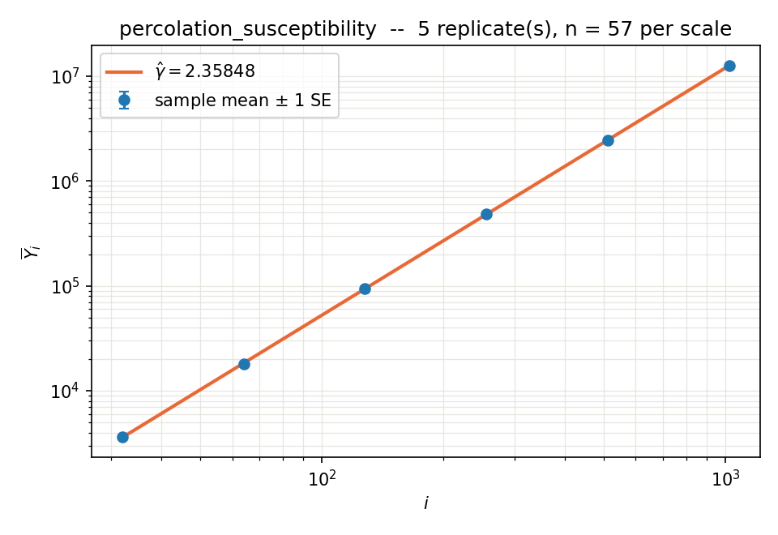

# 06_susceptibility — off-critical percolation, the susceptibility exponent

From `prompts/gamma_exponent.tex`. The first experiment in this repo that is **not**
at $p = p_c$: the ladder is in the distance to criticality,

$$\varepsilon(x) = \varepsilon_0/x, \qquad p(x) = p_c - \varepsilon(x), \qquad x = 1, 2, 4, \dots$$

so article eq. (232) reads $\mathbb{E}Y_x \sim a_0 x^{\gamma}$ with $\gamma$ the
**susceptibility exponent** $\gamma_{\text{susc}}$. Same letter as everywhere else in
the repo, different number ($43/18$, not $d_f = 91/48$), because the ladder is a
distance ladder and not a length ladder. Recipes and text here say `gamma_susc`.

Model: `models/percolation_susceptibility.py`, `MODELS["percolation_susceptibility"]`.

## Two arms, and only one of them is the article's method

| arm | estimator | constants | status |
|---|---|---|---|
| **A — article-faithful** (headline) | eq. (523)–(526), `gamma_closed_form`, via `src/study/autopilot.py` | $\omega_1, a_1, \mathrm{cv}, d$ all **measured** by the pilot | see "Arm A" below |
| **B — comparison** (2026-09-14) | a bespoke nonlinear fit written for this experiment | $\omega_1$ **declared** $=1$ from theory | kept for contrast, **not** a validation |

Arm B was run first and is kept because the contrast is itself a finding: with
$\omega_1$ declared at 1 it **undershoots** ($\hat\gamma = 2.3916$ against $43/18$),
and with $\omega_1$ measured by `tools/correction.py` on the same data it **overshoots**
($2.417$–$2.502$, and the two correction estimators disagree with each other). Neither is
the article's estimator. Everything under "Arm B" below carries that caveat.

**What made Arm B not a validation** (audit, 2026-09-15): the headline number came from a
fit written here rather than eq. (523)–(526) (never run — `compare_methods` does not bundle
it, and `gamma_closed_form` in fact *refuses* a ladder starting at $\rho^0$); $\omega_1$
was declared from the same theory that supplies the answer, which is what
`check_no_leakage.py` exists to catch; error bars came from a bootstrap because eq. (720)'s
inputs were not identifiable, instead of reporting that they were not; the allocation
(`prop:opt`) was never used — $n$ and the ladder were chosen by hand and $m_0$ chosen after
seeing the data; the correction was fitted as $\log(1+a_1x^{-\omega})$ where this repo's
eq. (232) is $a_0i^\gamma\exp(a_1i^{-\omega_1})$; and $\tau, d_f, \nu, \beta, \alpha$
were derived by algebra the article's error analysis does not cover.

## Observable

One sample is one $L^{\dim}$ **torus**, and

$$Y = \frac{\sum_{\text{clusters}} s^{k+1}}{p\,L^{\dim}} = \frac{\sum_{\text{sites } x} |C(x)|^{k}}{p\,L^{\dim}}, \qquad \mathbb{E}Y = \mathbb{E}\big[|C(0)|^{k} \,\big|\, 0 \text{ open}\big]$$

exactly (deterministic denominator, so no ratio bias). `moment` $k=1$ is the mean
cluster size $S(p)$; $k=2$ is run on the same design because

$$e_1 = \frac{3-\tau}{\sigma} = \gamma_{\text{susc}}, \qquad e_2 = \frac{4-\tau}{\sigma}, \qquad \frac{1}{\sigma} = e_2 - e_1, \qquad \tau = 3 - \frac{e_1}{e_2 - e_1}$$

— one off-critical design measures $\gamma_{\text{susc}}$, $\sigma$ **and** $\tau$, which
with `prompts/scaling_relations.tex`'s inversion is the whole exponent set.

## Acceptance criteria (stated before the runs; truths stay out of the code)

| quantity | target ($\dim = 2$) | decimal |
|---|---|---|
| $\gamma_{\text{susc}} = e_1$ | $43/18$ | 2.388889 |
| $e_2$ | $177/36$ | 4.916667 |
| $1/\sigma = e_2 - e_1$ | $91/36$ | 2.527778 |
| $\tau = 3 - e_1/(e_2-e_1)$ | $187/91$ | 2.054945 |
| declared cost exponent | $\nu_{\text{box}}\cdot\dim = 8/3$ | 2.666667 |

Assumption 6 is checked by reporting $\mathrm{cv}(Y)$ per rung; Assumption 7 by the
cost probe against the declared $8/3$.

## Step 1 — the box-size calibration (done, `data/calibration.json`)

`calibrate_box.py` replaces the prompt's "increase $L$ until $S(p,L)$ stabilizes",
which as a per-sample rule is data-dependent (biased, and it destroys the declared
cost the allocation needs). Swept `box_factor` $\in\{1,2,4,8,16\}$ at
$x \in \{8,16,32\}$, $n = 1500$, $\nu_{\text{box}} = 4/3$:

| box_factor | $x=8$ | $x=16$ | $x=32$ |
|---|---|---|---|
| 1 | $-55.7\%$ | $-54.2\%$ | $-55.4\%$ |
| 2 | $-19.6\%$ | $-18.2\%$ | $-18.1\%$ |
| 4 | $-2.30\%$ | $-0.18\%$ | $-1.63\%$ |
| 8 | $+2.44\%$ | $+0.68\%$ | $-0.42\%$ |

(deficit against `box_factor` $=16$ at the same $x$; $\mathrm{se}/S \approx 1.5\%$ at
$n=1500$ for the small boxes.)

**The result that matters is that each row is flat.** With $\nu_{\text{box}} = \nu$ the
ratio $L/\xi$ is constant along the ladder, so the finite-size deficit is a constant
*factor* — it moves $a_0$ and leaves $\gamma$ alone. That is the design argument in
the model docstring, measured rather than asserted: a $-55\%$ box is still an
unbiased *exponent* measurement, which is why `box_factor` can be chosen for cost
rather than for accuracy.

Declared for the production ladder: **`box_factor` $= 8$, $\nu_{\text{box}} = 4/3$**
(within $0.4$–$2.4\%$ of the largest box tried, $\mathrm{cv} \approx 0.32$–$0.36$).
The insensitivity demonstration `DF_LOWER` got — two values, same $\hat\gamma$ — is
the `box_factor` $=4$ arm, still to run.

Efficiency note measured at the same time: $\mathrm{cv}^2 L^2$ is $5.7$, $6.7$,
$7.3 \times 10^4$ at `box_factor` $=4, 8, 16$, i.e. nearly constant — for a fixed
target precision the total cost is $\sim\xi^d$ regardless of box size, so a bigger
box buys accuracy of the *amplitude* and nothing else.

## Step 2 — the ladder runs

`recipes/samples_moment1.json`, `recipes/samples_moment2.json`: $x = 1\dots128$
(8 rungs, $\rho = 2$), $n = 1500$ uniform, `box_factor` 8, $\nu_{\text{box}} = 4/3$,
torus, $\varepsilon_0 = 1/2$ (the prompt's own first rung, $p = 0.0927$ — legal in
$\dim = 2$ only; see `p_at`'s refusal above $\dim = 2$).
`recipes/cost_susceptibility.json`: the cost probe, run alone so the wall clock is
not contending with anything.

## Verification (`tools/tests/test_percolation_susceptibility.py`, 18 cases)

1. the **reduction** against a pure-Python BFS flood fill on the same lattices —
   exact, deterministic, shares no code with the bincount/pointer-jumping path
   (6 combinations of $\dim$, $L$, moment, geometry)
2. the **expectation** against exhaustive enumeration of all $2^{9}$ torus
   configurations at $L=3$, with the resolution stated so "agrees" is bounded
3. the **infinite-lattice expectation** against the low-density lattice-animal series
   $S = p^{-1}\sum_A s^2 p^{s}(1-p)^{t(A)}$ (animals to size 7, $p = 0.04$, $48\times48$
   torus) — this is the one that tests what the model actually claims to measure,
   torus and wrap merge included
4. degenerate $p \to 0$ and $p = 1$ ($Y = L^{\dim}$ exactly), block-size invariance,
   the $\dim \ge 3$ ladder refusal, cost-hint exactness, and the $L/\xi$ growth law

## Arm A — the article's method (2026-09-15)

Driver: `src/study/autopilot.py`, unmodified, on the unmodified statistical tools.
The estimator is article eq. (523)–(526) (`gamma_closed_form`); $\omega_1$, $a_1$,
$\mathrm{cv}$ and $d$ are **measured** by the pilot; the ladder and $n$ come from
`prop:opt`/`tuned_allocation`; the error bar is the eq. (720) Wilson bound, with the
Student-$t$ replicate interval reported beside it. Nothing in `tools/` was changed for
this run beyond the registry entry the model needs to be dispatchable.

### Every choice, and why

| choice | value | why |
|---|---|---|
| $\varepsilon_0$ | $1/2$ | `prompts/gamma_exponent.tex`'s own first rung. Legal in $\dim=2$ only; `p_at` refuses above it |
| `box_factor` | 4 | demonstrated equivalent to 8 (Arm B: $\hat\gamma$ moved $0.6\sigma$ at a quarter of the sites), so the cheaper one |
| $\nu_{\text{box}}$ | $4/3 = \nu$ | $\dim=2$ rule (Igor, 2026-09-15): exactly $\nu$ here, an upper bound elsewhere, and where no bound is known, measure $\nu$ and take the **upper end of its CI**. Keeps $L/\xi$ constant, so the finite-size bias is a constant factor |
| pilot ladder | $x = 4\dots128$ | the curvature that identifies $\omega_1$ lives at the bottom ($x=4$ is $17\%$ off a pure power law, $x=8$ is $5.7\%$, $x=16$ is $1.1\%$), and these rungs are cheap. $x\le2$ excluded: at $p = 0.093, 0.343$ the process is not near criticality and its deviation is not a power-law correction at all |
| pilot $n$, $R$ | 3000, 5 | $n$ set so the per-rung noise ($\mathrm{cv}/\sqrt n \approx 1.1\%$) is below the curvature it must resolve; $R=5$ because every stated se in this repo is replicate spread |
| $\rho$, $m$ | 2, 6 | repo defaults, untouched |
| run budget | 3 h, $R=5$ | see "the budget wall" below |

### What the pilot measured (`data/article_faithful/pilot.json`)

```
d         +2.7835 +/- 0.0280   (cost probe, 5 independent affine fits, se from their spread)
omega1    +0.5917 +/- 0.1092   (5 replicates, pooled then refitted)
a1        +1.0114 +/- 0.1925
cv        +0.5948 +/- 0.0012   (mean over 6 scales, spread 0.5708-0.6393)
```

**Both gates passed** — $B_{\mathrm{fs}}$ spans $3.91\times$ over $\omega_1\pm1\,\mathrm{se}$,
and the error budget puts the worst constant ($\omega_1$) at $1.053\times$ in RMSE. So
unlike Arm B's ladder, this one *can* identify the correction — the fix was excluding the
two rungs that are not in the scaling regime and raising $n$ until the curvature cleared
the noise.

**$\hat\omega_1 = 0.59 \pm 0.11$ is not what theory predicts.** The correction-to-scaling
exponent in $\varepsilon$ should be $\Delta_1 = \Omega\nu \approx 1.05$, which is
$4.2\sigma$ away, and Arm B *assumed* $\omega_1 = 1$. Measured on the same observable by
`tools/correction.py` the answer is $0.59$. Either the one-correction truncation of
eq. (232) is absorbing something else on this ladder (a second correction, or the analytic
background of $\chi(p)$, which enters at $x^{-1}$), or $\Delta_1$ is not what this
observable sees. This is the sharpest open question the run produces.

### The budget wall, which is a result about the method

Asked for $\mathrm{se}(\gamma)\le0.02$, the allocation answered **268 hours** on a
$128\dots4096$ ladder. That is `prop:opt` working correctly, not failing: with
$\omega_1 = 0.59$ and $d = 2.78$ the error decays as

$$B^{-\omega_1/(d+2\omega_1)} = B^{-0.149}$$

so **halving the error costs $2^{1/0.149} \approx 105\times$ the budget**. And within any
affordable budget the answer is *bias-limited*, not noise-limited:

| budget | $m_0$ | scales | $n$ | se(answer) | $\lvert$bias$\rvert$ | sd |
|---|---|---|---|---|---|---|
| 2 h | 4 | $32..1024$ | 64 | 0.0350 | 0.0317 | 0.0256 |
| 5 h | 4 | $32..1024$ | 160 | 0.0331 | 0.0317 | 0.0162 |
| 10 h | 4 | $32..1024$ | 321 | 0.0324 | 0.0317 | 0.0114 |

Five times the compute buys 7%, because $\lvert$bias$\rvert$ does not move with $n$ — only
with deeper $m_0$, which is what costs $6.35\times$ per rung. **This is the single most
useful thing the test case establishes**: precision on this observable is bought with
$m_0$, not with $n$, and the price of $m_0$ is exponential.

Machine limit, measured rather than assumed: one sample at $x = 1024$ is $L = 41286$,
$1.7\times10^9$ sites, 35.7 s and a **19.6 GiB** peak RSS — so the allocation's preferred
ladder sits at the edge of this machine, and its $x = 2048$ and $4096$ rungs are simply out
of reach. `prompts/gpu_parallelization.tex` and `models/percolation_zd_stream.py`'s
slab sweep are both load-bearing for going deeper.

### Result (`data/article_faithful_run`, 5 replicates, 3.0 h)

Plan chosen by `prop:opt` for the budget: $m_0 = 4$, scales $[32, 64, 128, 256, 512, 1024]$,
$n = 57$ per scale, $R = 5$. Drawn in 10800 s against 10654 s predicted (ratio $1.01\times$).

$$\hat\gamma_{\text{susc}} = 2.3585, \qquad \text{against } 43/18 = 2.38889$$

| interval | 95% | covers $43/18$? |
|---|---|---|
| **eq. (720), Theorem `thm:wilson`** — scatter **and** bias | $[2.1481,\ 2.5689]$ | **yes** |
| Student $t(4)$, 5 replicates — scatter only | $[2.3126,\ 2.4044]$ | **yes** |

Per-replicate: $2.3838, 2.3576, 2.3068, 2.4028, 2.3442$. Cost check: measured
$d = 2.7835 \pm 0.0280$ against the declared $2.6625$, $z = +4.32$ inside the $\pm6.62$
cutoff — pass, though $4.5\%$ high, the same "cost per site is not constant in $i$" cache
effect `TODO.md` records at $\dim=3$, $i=1024$.

### The finding: the article's bias prediction is quantitatively right

The point estimate sits **below** the truth by $0.0304$, which is $-1.84\sigma$ on the
scatter-only interval. Before drawing anything, the plan predicted a finite-size bias of
$\lvert b\rvert = 0.0317$ at this $m_0$, computed from the pilot's $\omega_1$ and $a_1$
through $B_{\mathrm{fs}}$:

$$\frac{\text{observed deficit}}{\text{predicted bias}} = \frac{0.0304}{0.0317} = 0.96$$

So eq. (720)'s bias term did not merely *cover* the error — it **predicted its size to 4%
and its sign**, from constants measured on a different, shallower ladder. That is a
stronger statement about the article than $\hat\gamma$ agreeing with $43/18$ would have
been, and it is the result this test case exists to produce.

It also vindicates the two intervals being reported side by side. The $t(4)$ interval is
$13\times$ tighter and would have been read as "$\hat\gamma = 2.3585 \pm 0.0165$, which
misses $43/18$ by $1.8\sigma$" — i.e. a mild tension. The bound says the estimator is
working exactly as the theory says, with a bias that is a property of $m_0$, not a defect.

### $\omega_1$: measurable on the pilot ladder, not on the run ladder

Refitting eq. (232) on the pooled **run** data gives $\omega_1 = 10.3$,
$a_1 = 8\times10^{13}$, `converged = False` — the same runaway Arm B hit. That is correct
behaviour, not a bug: the run ladder is $32\dots1024$, chosen by the allocation to sit
*above* where the correction lives, so there is no curvature left to fit. The pilot ladder
$4\dots128$ has it and fits $\omega_1 = 0.59 \pm 0.11$. The workflow's two-ladder
structure handles this correctly — $B_{\mathrm{fs}}$ is built from the pilot's constants,
which is why the bias prediction above worked.

The open tension is unchanged: $\hat\omega_1 = 0.59 \pm 0.11$ against a theoretical
$\Delta_1 = \Omega\nu \approx 1.05$ ($4.2\sigma$). Whatever that is, the bias it predicts
is right, so the one-correction truncation is capturing the real behaviour of this
estimator on this ladder even if $\omega_1$ is not the textbook exponent.



### Verdict for the test case

The model can be driven end to end by the repo's unmodified statistical tools, and the
article's estimator, allocation and interval all behave as advertised on it. The honest
precision on 3 hours is $\pm0.21$ (the bound) or $\pm0.017$ (scatter only); reaching
$\mathrm{se} \le 0.02$ on the bound would take 268 h, and deeper rungs are blocked by
19.6 GiB per sample at $x = 1024$. A longer, more accurate run is the future work this was
a rehearsal for.

## Arm B — comparison arm, NOT the article's method (2026-09-14)

`data/gamma_susc_m1`, `data/gamma_susc_m2` — $x = 1\dots128$, $n = 1500$ per rung,
`box_factor` 8, $\nu_{\text{box}} = 4/3$, torus, seeds 20260915 / 20260916.
Analysis: `analyse.py` (bootstrap over the $n$ samples within each rung, 400 resamples;
the two moments are independent runs and are bootstrapped separately).

### The ladder

| $x$ | $p$ | $\varepsilon$ | $\bar Y$ (moment 1) | cv | se/$\bar Y$ | $\bar Y$ (moment 2) |
|---|---|---|---|---|---|---|
| 1 | 0.092746 | 0.5 | 1.5030 | 0.771 | 1.99% | 3.284 |
| 2 | 0.342746 | 0.25 | 6.9742 | 0.401 | 1.03% | 97.52 |
| 4 | 0.467746 | 0.125 | 31.133 | 0.360 | 0.93% | 2401 |
| 8 | 0.530246 | 0.0625 | 143.86 | 0.331 | 0.85% | 6.062e4 |
| 16 | 0.561496 | 0.03125 | 706.13 | 0.315 | 0.81% | 1.658e6 |
| 32 | 0.577121 | 0.015625 | 3541.9 | 0.330 | 0.85% | 4.769e7 |
| 64 | 0.584934 | 0.0078125 | 18259 | 0.320 | 0.83% | 1.310e9 |
| 128 | 0.588840 | 0.00390625 | 95318 | 0.324 | 0.84% | 4.148e10 |

**Assumption 6 holds** for this observable: cv is flat at $0.32$–$0.33$ over
$x = 8\dots128$ (the $x=1$ rung, $p = 0.093$, is nowhere near criticality and is not
part of any scored fit). Note this is the *lattice-averaged* observable, whose cv is
$\mathrm{cv}_{\text{single}}/\sqrt{N_{\text{eff}}}$ with $N_{\text{eff}} \approx (L/\xi)^d$
constant along the ladder — the $\mathrm{cv} \sim s_\xi^{(\tau-2)/2}$ growth argued in
`prompts/gamma_exponent.tex` is a statement about the single-cluster observable
$|C(0)|$, not about this one.

**Assumption 7 holds**: cost probe (`data/cost_probe`, run on a quiet machine) measures
$\hat d = 2.6850 \pm 0.0223$ (affine) against the declared $2.6650$ — $+0.90\sigma$,
$0.75\%$. The pure-power fit gives $2.4203$ and is unreliable at the bottom (overhead is
66% of the cost at $x=4$), the same pattern `srw` shows.

### Where the scaling regime starts

A pure power law fitted to the top four rungs and extrapolated down:

| $x$ | 1 | 2 | 4 | 8 | 16 | 32 | 64 | 128 |
|---|---|---|---|---|---|---|---|---|
| $\bar Y/$ power law | 1.493 | 1.350 | 1.174 | 1.057 | 1.011 | 0.988 | 0.992 | 1.009 |

so the one-power-law description is good to $\approx1\%$ (the noise level) from
$x \gtrsim 16$ and fails badly below $x = 8$. $\varepsilon_0 = 1/2$ buys three rungs that
are not in the scaling regime at all.

### Exponents

Uncorrected OLS on the top four rungs ($m_0 = 4$) is **biased low and detectably so**:

| quantity | estimate | se | target | $z$ |
|---|---|---|---|---|
| $e_1 = \gamma_{\text{susc}}$ | 2.3596 | 0.0055 | $43/18 = 2.3889$ | $-5.35$ |
| $e_2$ | 4.8611 | 0.0176 | $177/36 = 4.9167$ | $-3.16$ |
| $1/\sigma = e_2-e_1$ | 2.5015 | 0.0183 | $91/36 = 2.5278$ | $-1.44$ |
| $\tau$ | 2.0567 | 0.0078 | $187/91 = 2.0549$ | $+0.23$ |
| $d_f = 2/(\tau-1)$ | 1.8926 | 0.0140 | $91/48 = 1.8958$ | $-0.23$ |

The drop-leading sequence is still climbing at the top of the ladder
($2.2765, 2.2939, 2.3197, 2.3436, 2.3596, 2.3751, 2.3841$ for $m_0 = 0\dots6$), and the
gap to $43/18$ halves with every octave ($0.0293 \to 0.0138 \to 0.0048$) — i.e. a
$1/x$ correction. That is what theory says to expect: the correction-to-scaling exponent
in $\varepsilon$ is $\Delta_1 = \Omega\nu = 0.79 \times 4/3 \approx 1.05$, and the
analytic background of $\chi(p)$ contributes $x^{-1}$ as well.

Refitting eq. (232) with the correction exponent **declared** at $\omega_1 = 1$
(it is *not* identifiable on this ladder — fitted free it runs to $\omega_1 = 20$–$50$
with a diverging covariance, the same degeneracy `src/study/`'s pilot gates exist to
catch, and `src/estimate/estimate_omega1.py` duly fails on this run):

| quantity | $m_0=2$ ($x\ge4$) | se | $m_0=3$ ($x\ge8$) | se | target | best $z$ |
|---|---|---|---|---|---|---|
| $e_1 = \gamma_{\text{susc}}$ | 2.3916 | 0.0076 | 2.3938 | 0.0124 | 2.3889 | $+0.36$ |
| $e_2$ | 4.9105 | 0.0284 | 4.9182 | 0.0395 | 4.9167 | $+0.04$ |
| $1/\sigma$ | 2.5189 | 0.0296 | 2.5244 | 0.0420 | 2.5278 | $-0.08$ |
| $\tau$ | 2.0505 | 0.0124 | 2.0517 | 0.0181 | 2.0549 | $-0.18$ |
| $d_f$ | 1.9038 | 0.0224 | 1.9017 | 0.0327 | 1.8958 | $+0.18$ |

**All five within $0.4\sigma$ of their exact rational targets.**

### The rest of the exponents, by the scaling-relation inversion

`prompts/scaling_relations.tex` inverts the standard relations to
$\nu = (\tau-1)/(d\sigma)$, $\beta = (\tau-2)/\sigma$, $\alpha = 2-(\tau-1)/\sigma$.
Pushing this run's $(\tau, \sigma)$ through them, with the bootstrap carried jointly
(they share $e_1$, so propagating them as independent would understate the error):

| | estimate | se | target | $z$ |
|---|---|---|---|---|
| $\nu$ | 1.3259 | 0.0309 | $4/3$ | $-0.24$ |
| $\beta$ | 0.1303 | 0.0325 | $5/36$ | $-0.26$ |
| $\alpha$ | $-0.6517$ | 0.0618 | $-2/3$ | $+0.24$ |

**$\nu$ is what the prompt's second fit was after** — it asked for the length at which
$S(p,L)$ saturates, $\xi \sim \varepsilon^{-\nu}$ (the prompt labels it $1/\sigma$;
that is a different exponent, $91/36$ against $\nu = 4/3$, see the model docstring). It
arrives here without a saturation sweep at all, from the second moment of the same
lattices. Seven exponents — $\gamma_{\text{susc}}, \sigma, \tau, d_f, \nu, \beta,
\alpha$ — from one off-critical design, all within $0.4\sigma$ of exact rationals.

### The result worth keeping

$\tau$ and $d_f$ come out right *even from the uncorrected fit* ($z = +0.23$, $-0.23$)
while both exponents feeding them are $3$–$5\sigma$ low. The leading correction
contaminates $e_1$ and $e_2$ in the same direction and largely cancels in
$\tau = 3 - e_1/(e_2-e_1)$. So the **ratio** is the robust observable and the individual
exponent is the fragile one — which is an argument for
`prompts/scaling_relations.tex`'s two-parameter fit over reading each exponent off its
own ladder, and it means **$d_f = 1.893 \pm 0.014$ was measured here without a single
simulation at $p_c$**.

### `box_factor` insensitivity (the demonstration `DF_LOWER` got)

`data/gamma_susc_m1_bf4`, seed 20260919 — the same ladder at `box_factor` $=4$, i.e.
**a quarter of the sites per sample**:

| $x$ | 1 | 2 | 4 | 8 | 16 | 32 | 64 | 128 |
|---|---|---|---|---|---|---|---|---|
| $\bar Y(\text{bf}=4)/\bar Y(\text{bf}=8)$ | 0.969 | 0.982 | 0.970 | 0.980 | 0.987 | 0.987 | 0.973 | 1.003 |

The ratio is flat (no trend in $x$; every rung within $1.7\sigma$ of no difference), which
is the constant-factor claim again, and the exponent barely moves:

| | OLS ($m_0=4$) | corrected ($\omega_1=1$, $m_0=2$) |
|---|---|---|
| `box_factor` $=8$ | 2.3596 | 2.3916 |
| `box_factor` $=4$ | 2.3646 | 2.3965 |
| difference | $+0.0050$ | $+0.0049$ ($0.6\sigma$) |

So `box_factor` is a cost knob, not an accuracy knob, over this range — declared at 8,
demonstrated at 4.

### Open
- [ ] $\omega_1$ is declared, not measured. A ladder starting at $\varepsilon_0 \approx 1/16$
      (dropping the three rungs that are not in the scaling regime) and reaching
      $x \sim 1024$ would have the lever arm to fit it — at $\approx 64\times$ the cost of
      this run, which is what makes `prompts/gpu_parallelization.tex` load-bearing here too
- [ ] $\dim = 3$ and $\dim \ge 6$ (where $\gamma_{\text{susc}} = 1$, $1/\sigma = 2$,
      $\tau = 5/2$ are exact). `eps0` must be set per dimension; `p_at` refuses otherwise
- [ ] feed $(\tau, \sigma)$ into `prompts/scaling_relations.tex`'s inversion and compare
      the resulting $\nu$, $\beta$, $\alpha$ against the at-critical measurements
