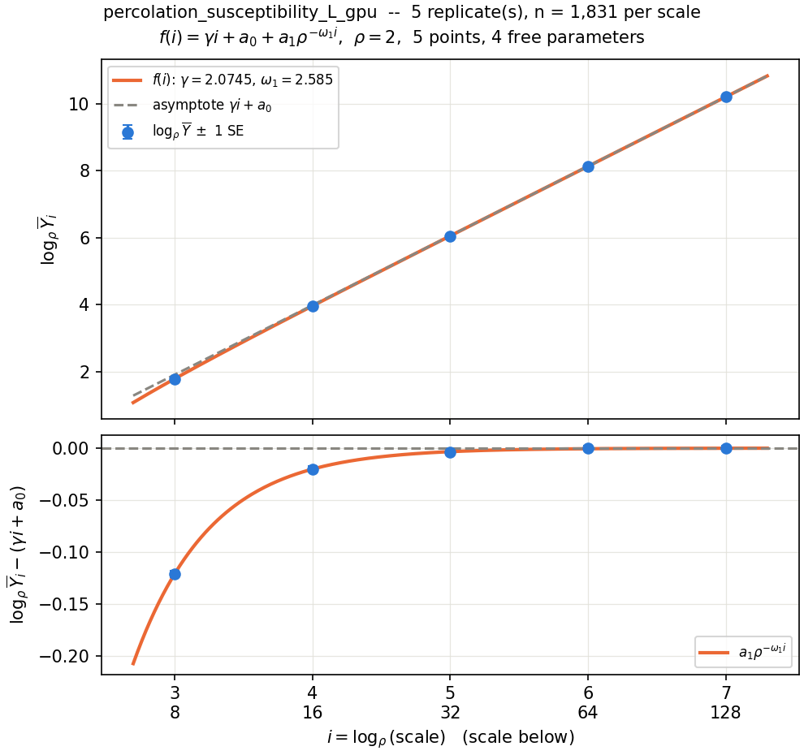
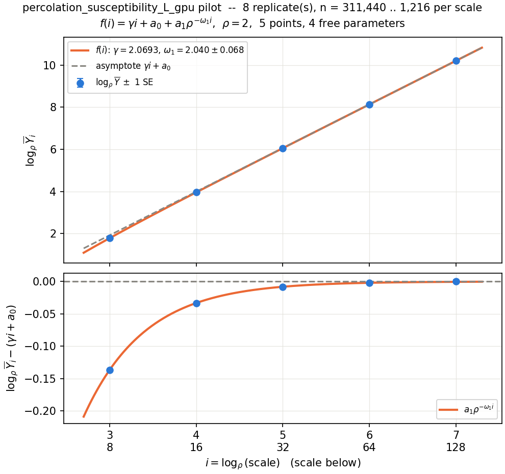

# γ_susc in d = 4 on the exact box ladder: the fit graph, and what more precision costs

Compiled 2026-09-21 from `pilot_gsusc_L_d4` (8 replicates, the constants) and
`autopilot_gsusc_L_d4` (the T4.2 production run, 5 replicates, 62 min). The analysis is
`time_to_precision.py`; every number below is its output. Same method as
`experiments/exponents_report.md` §4, for the one model that report could not plan
(γ(d = 4) there: "not plannable, ω₁ and a₁ unidentified"). The literature value is the
report's, Wikipedia's γ(d = 4) = 1.430(6), not re-read today.

## Headline

| target on γ_susc | one GPU, R = 5 replicates | can it run today? |
|---|---|---|
| **±0.006** (the literature's) | **≈ 4 min** on a 3-rung ladder L = 32, 64, 128. The standard 5-rung plan is 32 min but needs L = 256. | 3 rungs: the sampler can (128⁴ = 2.7·10⁸ sites), but `plan.py` and `report.py` refuse fewer than 5 rungs (§5). 5 rungs: **no**, 256⁴ = 4.3·10⁹ sites exceeds the int32 label (2.1·10⁹). |
| ±0.0006 (one more decimal) | **3 weeks to 7 months** (21 d at m = 2, 40 d at m = 4, 215–222 d at m = 3 and 5; 8.6 yr at m = 6) | **no**, top rung L = 256–2048 (4·10⁹–1.8·10¹³ sites) |
| ±0.00006 (two more) | **363 yr to 4·10⁴ yr** (m = 2..5) | **no**, top rung L ≥ 1024 |

- **The literature's precision is already in hand.** The deepest three rungs of the pilot
  (L = 32..128) give γ_susc = **1.4306**, eq. (720) ±0.0057; the same window of the T4.2 run
  gives 1.4326 ± 0.0065. The run reported 1.4495 ± 0.0278 (+0.0195 above 1.430) because its
  estimator used all five rungs, and the bottom two carry the finite-size bias.
- **More than that needs boxes past 128.** No ladder that fits an int32 label has a bias floor
  below 0.00102, so ±0.0006 is out of reach without the streaming sampler
  (`plans/streaming_percolation.md`), whatever the budget.
- **The times are order-of-magnitude.** They move 2.5× to 18× with ω_L, and swing 10× with the
  ladder width m through the integer m₀ staircase (§5). Read the ranges, not the point values.

## 1. The graph

`f(i) = γ i + a₀ + a₁ ρ^(−ω₁ i)`, drawn in the rung index `i = log_ρ L` against `log_ρ Ȳ`.
That is eq. (232) exactly, with `a₀ → log_ρ a₀` and `a₁ → a₁/ln ρ`. The top panel is the data
with the fit and its asymptote; the bottom subtracts the asymptote, which is the only place the
correction is visible (about 0.2 at the bottom rung, on a range of 10 in the top panel).



*The T4.2 run, pooled, refitted: γ_L = 2.0745, ω_L = 2.585, a₁ = −18.13.*



*The pilot, pooled, refitted: γ_L = 2.0693, ω_L = 2.040 ± 0.068, a₁ = −6.59.*

Reading them:
- **Five points, four parameters.** One degree of freedom, so the curve passing through every
  point says little (`rel_rmse` 1.4·10⁻⁴). The graph states this in its title.
- **The two fits disagree on ω_L** by 8 of the pilot's standard errors (2.040 vs 2.585), and on
  a₁ by a factor 2.8. The pilot's error bar is the spread of per-replicate fits, so it is
  statistical only; a one-term model fitted with different weights giving a different
  exponent is misspecification: the effective-exponent effect the earlier report cites from
  `06_susceptibility`.
- **The fit asymptotes agree with the windows in §3.** ν_box·γ_L = 1.4314 (run) and 1.4278
  (pilot), against the windows' 1.4326 and 1.4306. No error bar is attached to the fit's γ.

`pilot.py`, `report.py` (hence `autopilot.py`) and `plan.py` now write this graph:
`pilot_fit.png`, `fit.png`, and `plan_fit.png` (with `--plot`, or `--accept`), where the
pilot's fit is extended over the planned ladder, shaded.

## 2. Conventions

- **Targets are converted.** The tools work in γ_L (exponent against the box side L); the
  literature quotes γ_susc = ν_box·γ_L with ν_box = 0.69, so ±σ on γ_susc is ±σ/0.69 on γ_L
  (0.006 → 0.0087). Forgetting it understates every cost.
- **Error on the answer** is `sqrt(bias² + sd²/R)` at R = 5, as `plan.py --target-se`
  defines it; the bias does not average away. The ceiling on the budget is raised from 10¹⁸
  to 10⁴⁰.
- **Constants** are the pilot's: d = 4.096 (probe), ω_L = 2.040 ± 0.068, a₁ = −6.59,
  cv = 0.177, throughput 7.29·10⁸ sites/s (the pilot's batched cost probe).
- **✗** marks a top rung with more than 2³¹ − 1 sites, the int32 label of both labellers.
  Sites per sample are L⁴ exactly on this ladder. Top rung L ≤ 215; on a power-of-two ladder,
  128.
- **m = 5** is the ladder width of the last study (the eq. (232) refit needs five rungs).
  The earlier report used m = 6; that column is in §4.
- **eq. (720)** is extended as in the earlier report: per-scale variance, harmonic-mean n, and
  R replicates shrink only the statistical term. Its ω₂ piece is missing (needs φ₊), so each
  half-width is a lower estimate of the true bound.

## 3. Does the pilot's extrapolation hold?

Observed gap to 1.430 against the bias the pilot's own (ω_L, a₁) predicted for that window.

| draw | window | γ_susc | stat se | eq. (720) ± | observed − literature | predicted |
|---|---|---|---|---|---|---|
| pilot, 8 reps | L = 8..128 (m = 5, m₀ = 2) | 1.4488 | 0.0003 | 0.0259 | +0.0188 | +0.0209 |
| pilot | L = 16..128 (m = 4, m₀ = 3) | 1.4351 | 0.0005 | 0.0104 | +0.0051 | +0.0072 |
| pilot | L = 32..128 (m = 3, m₀ = 4) | **1.4306** | 0.0008 | 0.0057 | +0.0006 | +0.0026 |
| run, 5 reps | L = 8..128 (m = 5, m₀ = 2) | 1.4495 | 0.0006 | 0.0267 | +0.0195 | +0.0209 |
| run | L = 16..128 (m = 4, m₀ = 3) | 1.4358 | 0.0008 | 0.0111 | +0.0058 | +0.0072 |
| run | L = 32..128 (m = 3, m₀ = 4) | **1.4326** | 0.0012 | 0.0065 | +0.0026 | +0.0026 |

**Consistent.** Every observed gap sits at or below its prediction, and the gap shrinks with m₀
as a decaying correction requires. The run's own report gives ±0.0278 on its 5-rung window;
0.0267 here differs only because `report.py` does not shrink the statistical term by √R.
The check has a limit: the literature is itself ±0.006, so a gap of +0.0006 to +0.0026 cannot
distinguish a bias of 0.0026 from none. The next table does not use the literature.

Three-rung windows slid up the ladder, no fit involved. If the correction is a geometric
decay, each step shrinks by ρ^(−ω_L):

| draw | window | γ_susc | step | ratio | implied ω_L |
|---|---|---|---|---|---|
| pilot | L = 8..32 | 1.4722 | | | |
| pilot | L = 16..64 | 1.4385 | −0.0337 | | |
| pilot | L = 32..128 | 1.4306 | −0.0079 | 0.233 | 2.10 |
| run | L = 8..32 | 1.4719 | | | |
| run | L = 16..64 | 1.4383 | −0.0337 | | |
| run | L = 32..128 | 1.4326 | −0.0057 | 0.169 | 2.56 |

The pilot's 2.10 supports its fitted 2.04 ± 0.07, and the run's 2.56 its own refit's 2.585.
The run's last step (−0.0057) has a statistical error of at least 0.0012 (that window's own
se), which puts at least ±0.036 on its ratio, so the two ratios (0.233 and 0.169) differ by
under 2σ. Pilot and run agree with each other at m₀ = 4 to 0.0020 (1.4σ).

## 4. Time to σ, σ/10, σ/100, one GPU, R = 5, m = 5

| target | on γ_L | time (ω_L ± 1 se) | statistical term only |
|---|---|---|---|
| σ = 0.006 | 0.0087 | **32 min** (m₀ = 3, L = 16..256, 4.3·10⁹ sites/sample ✗)<br>ω+1se: 18 min<br>ω−1se: 11.2 h (m₀ = 4, L = 32..512, 6.9·10¹⁰ ✗) | 35 s |
| σ/10 = 0.0006 | 0.00087 | **215 d** (m₀ = 5, L = 64..1024, 1.1·10¹² ✗)<br>ω+1se: 309 d<br>ω−1se: 290 d | 59 min |
| σ/100 = 6·10⁻⁵ | 8.7·10⁻⁵ | **3.8·10⁴ yr** (m₀ = 7, L = 256..4096, 2.8·10¹⁴ ✗)<br>ω+1se: 2,934 yr<br>ω−1se: 1.9·10⁴ yr | 4.1 d |

- **Non-monotone in ω**, as in the earlier report: m₀ is an integer, and the bisection stops at
  the first budget that meets the target. ω+1se costs 18 min at σ but 309 d at σ/10.
- **At m = 6** (the earlier report's ladder): 2.4 h (L = 16..512), 8.6 yr (L = 64..2048),
  3.5·10⁴ yr (L = 128..4096), all ✗.
- **On the run's own refit constants** (ω_L = 2.585, a₁ = −18.13), the same m = 5 plans cost
  **13 min, 33 d, 2,085 yr**: 2.5×, 6.5× and 18× cheaper. That is the size of the ω_L
  disagreement in §1, in wall clock.
- **Last column:** the pilot's own wall clock (84 min) scaled by (se/target)² at its deepest
  four-rung window, ignoring bias. An optimistic floor, not a plan.

## 5. Ladders that fit an int32 label (top rung L ≤ 128), σ = 0.006

| m | ladder | bias floor on γ_susc | time at ω_L | ω+1se | ω−1se |
|---|---|---|---|---|---|
| 2 | L = 64..128 | 0.00102 | 1 min | 1 min | 3 min |
| **3** | **L = 32..128** | **0.00262** | **4 min** | 6 min | 4 min |
| 4 | L = 16..128 | 0.0072 | never | 1.2 h | never |
| 5 | L = 8..128 | 0.0209 | never | never | never |

The m = 3 plan: n = 133 samples per rung per replicate, 3.8·10¹⁰ sites per replicate, predicted
answer error 0.0055 (bias 0.0026, scatter 0.0048). The lowest floor is 0.00102, so no legal
ladder reaches σ/10. This is why T4.2 was bias-limited: five rungs put the bottom at L = 8.

**What this route needs that does not exist yet.** `plan.py` refuses `--m < 5`, and
`report.py`'s eq. (232) refit needs five rungs, so a 3-rung run would be drawn in full and fail
at the report. m = 2 (two rungs) has no degree of freedom to check anything with, so m = 3 is
the practical choice; even there the correction cannot be refitted on the run's own data, so ω_L
and a₁ have to come from a pilot.

## 6. Sensitivity to the ladder width m (ω_L, no ceiling)

| m | σ | σ/10 | σ/100 |
|---|---|---|---|
| 2 | 1 min, L = 64 | 21 d, L = 256 | 4,293 yr, L = 1024 |
| 3 | 4 min, L = 128 | 222 d, L = 512 | 363 yr, L = 1024 |
| 4 | 1.0 h, L = 256 | 40 d, L = 512 | 2,367 yr, L = 2048 |
| 5 | 32 min, L = 256 | 215 d, L = 1024 | 3.8·10⁴ yr, L = 4096 |
| 6 | 2.4 h, L = 512 | 8.6 yr, L = 2048 | 3.5·10⁴ yr, L = 4096 |
| 7 | 20.1 h, L = 1024 | 146 yr, L = 4096 | 1.2·10⁵ yr, L = 8192 |

The per-sample cost is 94% the top rung, so fewer rungs cost the same per sample but have a
larger variance (‖w‖² = 12/(m(m²−1)): 0.5 at m = 3, 0.1 at m = 5), and a higher bottom rung has
less bias. Which wins is the m₀ staircase, hence the swings.

## 7. What the times leave out

- **Constant throughput.** The plan charges L⁴ sites at a fixed sites/s. The clock measured
  d̂ = 4.096 against the declared 4, so if that holds beyond the probed range each doubling of
  L costs ≈ 7% more (2^0.096) than the plan assumes.
- **p_c.** A shift δp moves the system off criticality by δp·L^(1/ν); at L ~ 10³ in d = 4 the
  digits of p_c in `P_C_SITE_HYPERCUBIC` would have to improve before ±0.0006 means anything.
- **One correction term.** Both the plan and eq. (720) use a single ω_L. The ω₂ piece is not
  measured, and the pilot and refit disagree by 8 se (§1), so the bias floors above carry a
  model error the stated ranges only partly cover.
- **The exponent itself is unexplained.** ω_L = 2.04 is ω_x = ν_box·ω_L = 1.41 in ε, against
  Δ₁ ≈ 0.77 expected; `TODO.md` lists that as not understood. It is one more reason not to
  trust ω_L to its stated error.
- **The time is for one GPU.** Replicates are independent, so N GPUs divide it by N.

## Reproduce

```bash
D=experiments/09_percolation_susceptibility_gpu/data
# the graph of the last run: on a COPY (S = any scratch dir), since report.py rewrites the
# study's answer.json, report.md, details.md and plot.png in place
mkdir -p $S && cp -r $D/autopilot_gsusc_L_d4 $S/ && python3 src/study/report.py --study autopilot_gsusc_L_d4 --data-root $S
python3 src/study/plan.py --study pilot_gsusc_L_d4 --data-root $D --m 5 --target-se 0.0087 --plot
python3 experiments/09_percolation_susceptibility_gpu/time_to_precision.py --data-root $D --run autopilot_gsusc_L_d4          # m = 5
python3 experiments/09_percolation_susceptibility_gpu/time_to_precision.py --data-root $D --m 6                                # the earlier report's width
```

`plan.py` takes the target on γ_L: 0.0087 is σ = 0.006 divided by ν_box = 0.69.
