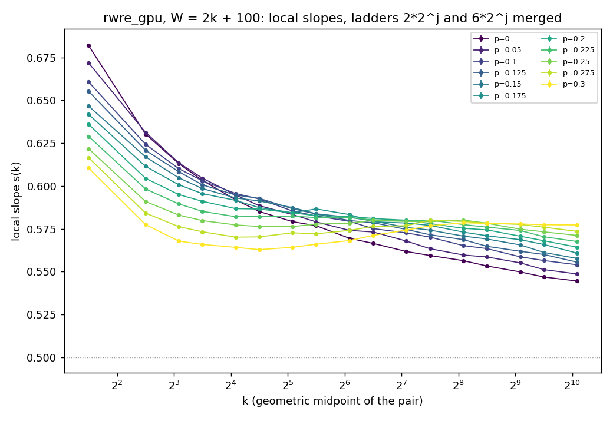

# Experiment 16 — the hump in `rwre`'s local slopes

**Question.** Is the non-monotone local slope $s(k)$ seen in 13 and 15 a crossover that
moves with $p$, as conjectured below, and does it close up as $p\to0$ (user,
2026-09-30)? This experiment only draws pilots and reads their local slopes. It measures no
$\hat\gamma$ and plans nothing.

Why it matters. 13's and 15's pilots fit eq. (232), $\gamma+c\,k^{-\omega}$, on 4..1024.
For $p\ge0.2$ that range contains a dip and a rise in $s(k)$, which no single decaying
correction produces. The fit drives $\omega_1\to0$ ($0.016$–$0.036$, "not converged"),
and the Wilson bound blows up ($[-109,110]$ at $p=1/3$). 15 ruled out the window.

## The conjecture, from data that already exist (written 2026-09-30, before any draw)

The input is the inverse-variance merge of 13's and 15's `pilot_n1e5` slopes (4..1024) and
13's `RWRE_longsieve` slopes (up to $2^{16}$–$2^{17}$). The dyadic ladder places each slope
at its lower scale. With $\delta=\tfrac12-p$, there are two features:

| $p$ | $\delta$ | dip $k_{\min}$ (min of $s$) | peak $k_{\max}$ | $s(k_{\max})-s(k_{\min})$ |
|---|---|---|---|---|
| 0 | 0.5 | none (monotone to $2^{15}$) | none | — |
| 0.1 | 0.4 | none | none | — |
| 0.2 | 0.3 | shoulder at 64–128 | (same) | $\lesssim0.001$ |
| 0.3 | 0.2 | ~11 | ~300 | 0.015 |
| 1/3 | 0.167 | ~16 | ~600–2000 | 0.025 |
| 0.4 | 0.1 | ~24–32 | ~$4\times10^3$–$3\times10^4$ | 0.04 |
| 0.45 | 0.05 | ~60 | beyond 512 | — |

- **H1, the hump moves.** The dip drifts slowly, $k_{\min}\propto\delta^{-1.2}$, and the peak
  fast, $k_{\max}\propto\delta^{-\varphi}$ with $\varphi\approx5$ (from 0.3, 1/3 and 0.4).
- **H2, it closes.** Because the peak moves faster, going down in $p$ brings the peak onto
  the dip. The hump's amplitude goes to zero at some $p_c$. Extrapolating
  $k_{\max}=300\,(\delta/0.2)^{-5}$ onto $k_{\min}=11\,(\delta/0.2)^{-1.2}$ puts
  $p_c\approx0.1$. The plateau at $p=0.2$ suggests it could be as high as 0.2.
  **Pre-registered: $p_c\in[0.1,0.25]$.**

Predictions for the grid below, read off the two power laws (a factor of 2 in $k$ is
the tolerance, since the inputs are eyeballed vertices):

| $p$ | 0.3 | 0.275 | 0.25 | 0.225 | 0.2 | 0.175 | 0.15 | ≤0.1 |
|---|---|---|---|---|---|---|---|---|
| $k_{\min}$ | 11 | 10 | 8.5 | 7.6 | 6.6 | 6.0 | 5.4 | — |
| $k_{\max}$ | 300 | 170 | 100 | 60 | 40 | 27 | 18 | merged: no hump |

**Falsified if:**
- a resolved hump (amplitude $>3$ se) appears at $p=0$ or $0.05$;
- $k_{\max}$ is not monotone in $p$ over the $p$'s where the hump is resolved;
- $k_{\max}$ misses the table by more than a factor of 2 at two or more $p\in[0.2,0.275]$;
- the hump is still resolved at $p=0.1$.

$p=0.3$ is in-sample (it calibrated the laws) and is a reproduction check, not a test.

## Design

`hump.py` runs `src/study/pilot.py` on `rwre_gpu` once per (p, ladder) and pools each
study's replicates through `tools/local_slope.analyse`. Everything is 15's except the
grid and the ladders.

- **Grid:** $p\in\{0, 0.05, 0.1, 0.125, 0.15, 0.175, 0.2, 0.225, 0.25, 0.275, 0.3\}$.
- **Window:** $W=2k+100$ (15's). The walker can't reach the seam.
- **Two interleaved dyadic ladders:** $2\cdot2^j$ (2..1024) and $6\cdot2^j$ (6..1536). Not $3\cdot2^j$: on odd $k$ the parity makes $\mathbb E\lvert X_k\rvert$ jump (for srw, $\mathbb E\lvert S_{2m-1}\rvert=\mathbb E\lvert S_{2m}\rvert$), which put the $3\to6$ slope at 0.37 in the smoke run.
  `local_slope` needs a constant ratio, so each ladder is analysed on its own at
  $\rho=2$. Together they put a slope every factor ~1.4 in $k$, at the pair's geometric
  midpoint $k\sqrt2$, where this README's table above used the lower scale.
  The two ladders are independent draws.
- **$n$:** 4 replicates × $10^6$ per scale. That puts se($s$) around $7\times10^{-4}$, about
  half of `pilot_n1e5`'s. One $n$ everywhere, so there is no $n$-mismatch bias
  (`local_slope.n_mismatch`).
- **Seeds:** `--seed` base $+$ an index per (p, ladder), recorded in each recipe and
  passed to `pilot.py`.

The hump is read off the merged $s(k)$ sequence as the largest rise
$s(k_j)-s(k_i)$ over $k_i<k_j$, so a single noisy local minimum can't hide the real one. Each point's se is the CLT's, `local_slope.clt_se` from cv and $n$, not the spread of 4
replicates. That spread has 3 dof, and at $R=2$ it produced a false 3-se hump at $p=0$
in the smoke run. The amplitude se is the two points'
$\sqrt{se_1^2+se_2^2}$, ignoring the negative covariance of consecutive slopes on one
ladder, so it is slightly optimistic. A hump counts as resolved at amplitude $>3$ se.

```bash
python3 experiments/16_rwre_hump/hump.py --tag n1e6 --seed 20260930
```

Results go to `data/hump_<tag>.md` and `data/hump_<tag>.png`, and are recorded here once
measured.

## Result, tag `n1e6` (2026-09-30)

22 pilots, all exit 0, 26 min of GPU time. se($s$) is $7$–$9\times10^{-4}$ at every point.




The driver's readout:

| $p$ | 0–0.15 | 0.175 | 0.2 | 0.225 | 0.25 | 0.275 | 0.3 |
|---|---|---|---|---|---|---|---|
| largest rise | none (monotone) | $0.0022\pm0.0011$ | none | $0.0005\pm0.0011$ | $0.0038\pm0.0011$ | $0.0099\pm0.0011$ | $0.0157\pm0.0011$ |
| resolved | no | no | no | no | **yes** | **yes** | **yes** |
| argmax $k_{\min}\to k_{\max}$ | — | 34 → 45 | — | 136 → 181 | 34 → 272 | 17 → 181 | 23 → 272 |

Post hoc (not pre-registered), quadratic in $\log k$ around each extremum, 68%
band from refits with $s$ perturbed by its se:

| $p$ | dip vertex | peak vertex |
|---|---|---|
| 0.25 | 31 [28, 33] | 149 [124, 170] |
| 0.275 | 23 [22, 24] | 251 [233, 281] |
| 0.3 | 23 [22, 24] | 387 [355, 431] |

The amplitude is linear in $p$ over the three resolved points ($0.0038, 0.0099, 0.0157$,
steps $0.0061, 0.0058$). It vanishes at $p_c=0.234$.

### Scored against the pre-registration

| criterion | outcome |
|---|---|
| no resolved hump at $p=0, 0.05$ | **pass** |
| no resolved hump at $p=0.1$ | **pass** |
| $p_c\in[0.1,0.25]$ | **pass**, $p_c\approx0.234$ |
| $k_{\max}$ monotone in $p$ where resolved | **fails** on the pre-registered argmax readout (272, 181, 272), because the tops are flat to within 1 se. The post-hoc vertices are monotone (149 < 251 < 387) |
| $k_{\max}$ within ×2 of the table at ≤1 of $p\in[0.2,0.275]$ | **fails**: no hump at 0.2 and 0.225 (predicted at 40 and 60). The vertices at 0.25 and 0.275 are within ×2 (149 vs 100, 251 vs 170) |

**Verdict: H1 survives, and H2's mechanism is falsified.**
- The hump is real, systematic and smooth in $p$. Its peak moves outward as $p\to\frac12$:
  $k_{\max}\propto\delta^{-\varphi}$ with $\varphi\approx4.3$ from the three vertices,
  consistent with the ~5 read off 13. That continues 13's 1/3 and 0.4.
- It does **not** close by the peak sliding down onto the dip. The dip stays at $k\approx25$,
  and the peak is still at $k\approx150$ when the amplitude reaches zero. The hump fades
  in place, linearly in $p-p_c$, at $p_c\approx0.234$.
- The figure shows the whole family pivoting about one region, $k\approx64$–128 at
  $s\approx0.58$. Below it, $s$ decreases with $p$, and above it, $s$ increases with $p$.
  The hump is the $p>p_c$ side of that pivot.

### What it means for $\omega_1$

Eq. (232)'s single correction needs $s(k)$ to approach its limit monotonically and convexly in
$\log k$. That fails on 4..1024 well below $p_c$ too:
- At $p=0.2$, $s$ is flat to $\pm0.002$ from $k=17$ to 135, then falls faster.
- At $p\le0.15$, $s$ falls at a nearly constant ~0.003 per factor $\sqrt2$ from $k\approx20$
  on, linear in $\log k$, which a power law reads as $\omega\to0$.

So any pilot fit whose window includes $k\lesssim$ a few hundred is misspecified at every
$p\ne\frac12$, and the hump is the extreme case of that. A fit that starts at
$k\gtrsim2k_{\max}(p)$, or past the pivot for $p<p_c$, is the next test. That needs 13's
longsieve range, not this one.
