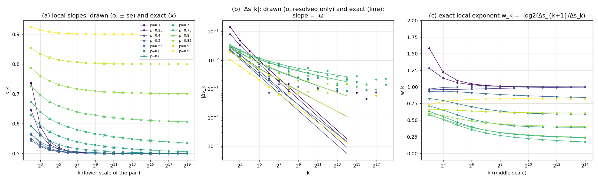

# Experiment 17 — the correction exponent $\omega$ of the ERW, across $p$

**Question (user, 2026-09-30).** A conjecture brought by the user says that the local slope
of $\mathbb E\lvert S_k\rvert$ for the elephant random walk has two corrections: one with
$\omega=1$ at every $p$, and one with $\omega=\lvert3-4p\rvert/2$ for $p\ne3/4$. At the critical
$p=3/4$ the correction is $1/\log k$, not a power law. Is that true? This experiment
draws pilots and reads their local slopes. It measures no $\hat\gamma$ and plans nothing.

The model, its regimes and what is proven are in `experiments/11_erw/README.md`. The
sampler is `erw_urn_gpu` (14).

## Hypotheses (written 2026-09-30, before the sweep was drawn)

**C (the conjecture).** $s(k)-\gamma\approx c_1k^{-1}+c_2k^{-\lvert3-4p\rvert/2}$, so the
leading exponent is $\omega_C=\min(1,\lvert3-4p\rvert/2)$, and $1/\ln k$ at $p=3/4$.

**M (alternative, same shape, exponent doubled).** $\omega_M=\min(1,\lvert3-4p\rvert)$, and
$1/\ln k$ at $p=3/4$. This is a heuristic derivation, not a theorem:
- $p<3/4$: solving eq. (A.3) in expectation with $\mathbb ES_1^2=1$ gives, exactly,
  $\mathbb ES_k^2=\frac{k}{3-4p}+C(p)\frac{\Gamma(k+4p-2)}{\Gamma(k)}$,
  $C(p)=\frac{2-4p}{(3-4p)\Gamma(4p-1)}$ (checked against the recursion to $10^{-14}$
  relative at $k=4096$, $p\in\{0.3,0.6,0.9\}$). The relative correction is
  $k^{-(3-4p)}$, and its amplitude vanishes at $p=1/2$, where the walk is `srw`
  ($\omega=1$ exactly). Note that C's literal $\lvert3-4p\rvert/2=1/2$ at $p=1/2$ needs
  the same vanishing amplitude.
- $p>3/4$: $S_k\approx Lk^{2p-1}+\sqrt k\,G$. The fluctuation enters $\mathbb E\lvert S_k\rvert$
  at second order because the law is symmetric, so the relative correction is
  $(\sqrt k/k^{2p-1})^2=k^{-(4p-3)}$. The same formula's second term above gives that
  exponent too.
- 11_erw already measured, on exact means at $p=0.6$, a gap shrinking like $k^{-0.59}$.

| $p$ | 0.1 | 0.25 | 0.4 | 0.5 | 0.55 | 0.6 | 0.65 | 0.7 | 0.75 | 0.8 | 0.85 | 0.9 | 0.95 |
|---|---|---|---|---|---|---|---|---|---|---|---|---|---|
| $\omega_C$ | 1 | 1 | 0.7 | 1* | 0.4 | 0.3 | 0.2 | 0.1 | log | 0.1 | 0.2 | 0.3 | 0.4 |
| $\omega_M$ | 1 | 1 | 1 | 1 | 0.8 | 0.6 | 0.4 | 0.2 | log | 0.2 | 0.4 | 0.6 | 0.8 |

\* `srw`: the second amplitude must vanish.

**Readout of the leading exponent.** The noise-free local exponent
$w_k=-\log_2(\Delta s_{k+1}/\Delta s_k)$ from the exact $\mathbb E\lvert S_k\rvert$, at the top
of the exact ladder (middle scale $2^{15}$). Under a single power law it is flat at $\omega$.
Under a sum of powers it drifts to the smallest one. Under $c/\ln k$ it falls like
$\approx2.885/\log_2k$ toward 0.

**Scoring.** A hypothesis is *consistent* at $p$ if $\lvert w_{\rm top}-\omega_H\rvert\le0.1$. The
discriminating $p$ (predictions $\ge0.2$ apart) are 0.4, 0.55, 0.6, 0.65, 0.85, 0.9, 0.95.
- **C is falsified** if it is inconsistent at 2 or more discriminating $p$. Same for M.
- **Critical**: the log form is supported if exact $w_k$ at $p=3/4$ falls steadily over
  the whole ladder with no plateau, and the drawn $(L)$ fit on $k\ge256$ has $p>0.01$.
- **Prerequisite (ground rule 1)**: at every $p$, the drawn $s_k$ agree with the exact
  ones, with check $\chi^2$ $p$-value $>10^{-3}$ and max $\lvert z\rvert<4$. A failure here voids that $p$.

## Design

`omega_sweep.py` runs `src/study/pilot.py` on `erw_urn_gpu` once per $p$, and pools the
replicates through `tools/local_slope.analyse` at $\rho=2$. This is 16's pattern.
`src/study/local_slope.py` itself needs a finished final run, and a final would add no
scale here.

- **Grid**: the 13 $p$ in the table.
- **Ladder**: $4..2^{20}$, dyadic (19 scales, 18 slopes). Even $k$ only, for the parity.
- **$n$**: $2^{23}$ per scale × 4 replicates, the same at every scale, so
  `local_slope.n_mismatch` is 0. se($s$) ≈ $2.6\times10^{-4}$ (CLT, cv ≈ 0.75).
- **Exact reference**: $\mathbb E\lvert S_k\rvert$ by DP over eq. (2.2)'s chain, on the same
  ladder up to $k=2^{16}$. That's $O(k^2)$ on CPU, ~45 s per $p$. It checks the draws
  and gives $w_k$ without noise. Beyond $2^{16}$, only the drawn slopes and the fits
  (P), (L), (2P) $=\gamma+c_1/k+c_2k^{-\omega}$ remain.
- **Seeds**: `--seed` + the index of $p$, recorded in each recipe.

```bash
python3 experiments/17_erw_omega/omega_sweep.py --tag n8m --seed 20260930
```

Results go to `data/omega_<tag>.{md,json,png}` and are recorded here once measured.

Smoke run (2026-09-30, $n=3\times10^5$ × 2, exact to 4096, $p\in\{0.6,0.9\}$): check
$\chi^2$ 5.2/10 and 8.9/10, so the path works. Not evidence.

## Result, tag `n8m` (2026-10-01)

13 pilots, all exit 0, 62 min (about 4.6 min per $p$, including the cost probe), plus 7 min of exact DP.



**Prerequisite: PASS at every $p$.** The drawn $s_k$ against the exact ones on $4..2^{16}$
(14 slopes): the worst check is $\chi^2=22.8/14$ ($p=0.06$) and max $\lvert z\rvert=2.5$.

**Leading exponent.** $w_{\rm top}$ is the exact $w_k$ at middle scale $2^{14}$, the last
column of `data/omega_n8m.md`. The pilot's own eq. (232) fit (`constants.json`, on
4..2²⁰) is shown for comparison.

| $p$ | $w_{\rm top}$ (trend) | pilot $\omega_1$ | $\omega_C$ | C | $\omega_M$ | M |
|---|---|---|---|---|---|---|
| 0.1 | 1.000 (flat) | 1.229 | 1 | ✓ | 1 | ✓ |
| 0.25 | 1.000 (flat) | 1.114 | 1 | ✓ | 1 | ✓ |
| **0.4** | 0.995 (↑ to 1) | 0.965 | 0.7 | **✗** | 1 | ✓ |
| 0.5 | 1.000 (flat) | 0.988 | 1* | ✓ | 1 | ✓ |
| **0.55** | 0.840 (↓) | 0.925 | 0.4 | **✗** | 0.8 | ✓ |
| **0.6** | 0.592 (flat) | 0.712 | 0.3 | **✗** | 0.6 | ✓ |
| **0.65** | 0.393 (flat) | 0.503 | 0.2 | **✗** | 0.4 | ✓ |
| 0.7 | 0.236 (↓) | 0.355 | 0.1 | ✗ (0.14) | 0.2 | ✓ |
| 0.75 | 0.172 (↓, no plateau) | 0.298 | log | see below | log | see below |
| 0.8 | 0.241 (↓) | 0.352 | 0.1 | ✗ (0.14) | 0.2 | ✓ |
| **0.85** | 0.405 (flat) | 0.480 | 0.2 | **✗** | 0.4 | ✓ |
| **0.9** | 0.605 (flat) | 0.640 | 0.3 | **✗** | 0.6 | ✓ |
| **0.95** | 0.816 (↓) | 0.801 | 0.4 | **✗** | 0.8 | ✓ |

Bold rows are the discriminating $p$.

**Verdict.**
- **C is falsified.** It is inconsistent at all 7 discriminating $p$, and it misses by
  0.2–0.4 each time. The non-power exponent is $\lvert3-4p\rvert$, not $\lvert3-4p\rvert/2$.
- **M is consistent at all 12 non-critical $p$**, within 0.05 everywhere. On both sides of
  $3/4$, the exponent is symmetric in $\lvert3-4p\rvert$: 0.6/0.9, 0.65/0.85 and 0.7/0.8
  match to 0.01.
- **The "$\omega=1$ at every $p$" part** is seen only where it leads, at
  $p\le1/2$ and $p=0.4$. Where $\lvert3-4p\rvert<1$, $w$ reads the smaller exponent, and
  nothing here isolates a $k^{-1}$ term underneath. (2P), which fixes $c_1/k$ and frees
  $\omega$, gives 0.54, 0.37, 0.25, 0.26, 0.41, 0.60 at $p=0.6..0.9$. Those are close to
  M and do not resolve the $1/k$ term.
- **Critical $p=3/4$: logarithmic, but not a single $c/\ln k$.**
  - Exact $w_k$ falls over the whole ladder (0.59 → 0.17) with no plateau, and still
    falls at the same rate where the other $p$ have flattened. So there's no power law,
    and the first half of the criterion passes.
  - The drawn (L) fit on $k\ge256$ is rejected ($\chi^2=79/10$, $p=7\times10^{-13}$), so
    the second half fails as pre-registered.
  - The exact slopes say why. $(s_k-\tfrac12)\cdot2\ln k$ climbs
    0.60, 0.68, …, 0.906, 0.915, 0.922, 0.928 at $k=4..2^{15}$, toward 1 like $1/\ln k$.
    That's $s_k=\tfrac12+\tfrac1{2\ln k}-O(\ln^{-2}k)$: the $\sqrt{k\ln k}$ law with its
    next logarithmic term. A two-parameter $\gamma+c/\ln k$ can't absorb the
    $\ln^{-2}k$ term.

**For the pipeline.** The pilot's eq. (232) fit tracks $\omega_M$ but is biased upward
near $3/4$, by +0.12–0.13 at $p=0.7, 0.8$. It reads 0.30 at $p=3/4$, where there's no
exponent to read, as 14 found (0.40 on 4..4096).
